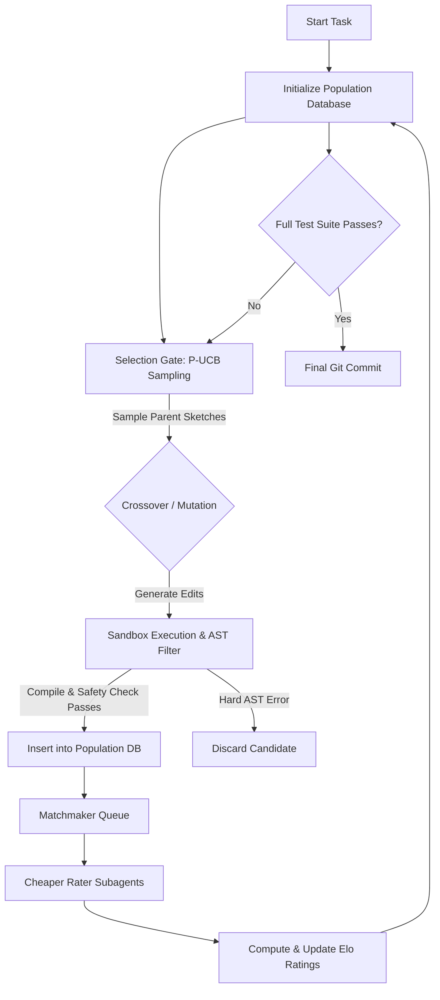

# JanusMaskJR — Translation Report: AlphaProof Nexus & Evolutionary Agentic Compilation

This report synthesizes the academic findings and architectural critiques from four parallel subagents regarding DeepMind's **AlphaProof Nexus** paper (*"Advancing Mathematics Research with AI-Driven Formal Proof Search"*, Google DeepMind, May 2026). It outlines concrete designs for translating these formal proof-search techniques into actionable reliability and performance improvements for **JanusMaskJR**.

---

## 1. Architectural Transition: Linear Dual-Agent vs. Population-Based Search

### The Current Constraint
JanusMaskJR currently enforces a rigid, lock-step dual-agent agreement contract between `claude` and `gemini`. If the agents diverge, or if either fails compiling or fuzzing, the task fails-closed.
*   **The Bottleneck:** For complex multi-file patches, the probability of both agents producing identical, error-free sets of edits decreases exponentially. A single typo in a single file invalidates a candidate's entire patch set, wasting the entire generation budget.

### The Evolutionary Solution: Shared Population Database
Instead of a single-shot agreement, the orchestrator is reorganized around a local, persistent **Population Database of Sketches (or Patch Candidates)**.



1.  **Pairwise Tournaments using Flash Models**: Absolute grading of code quality is inconsistent. Instead, a Matchmaker Queue schedules pairwise comparisons. Cheaper subagents (e.g., Gemini 3.0 Flash) compare Candidate A and Candidate B side-by-side, evaluating:
    *   *Minimality*: Surgical AST-level edits versus massive code rewriting.
    *   *Safety*: Lack of static analysis violations (e.g., bare excepts, open socket imports).
    *   *Fuzz Coverage*: Performance against differential fuzz inputs.
2.  **Elo Rating Calculations**: To convert binary compiler/test results into a smooth, continuous fitness landscape, we calculate Elo ratings for all sketches:
    $$E_i = \frac{1}{1 + 10^{(R_j - R_i) / 400}}$$
    $$R'_i = R_i + K \cdot (S_i - E_i)$$
    This ensures that "near-misses" (highly clean refactorings that fail a single test case) are preserved and rated highly, rather than being immediately discarded.
3.  **Selection via P-UCB**: We sample parent sketches from the database using a Predictive Upper Confidence Bound (P-UCB) formula to balance **exploitation** (high Elo) with **exploration** (low selection count):
    $$UCB(C_i) = \text{Elo}_i + c \cdot \sqrt{\frac{\ln N}{n_i}}$$
4.  **Crossover Operators**:
    *   *File-Level Crossover*: If Candidate A fixes `auth.py` but fails `db.py`, and Candidate B fixes `db.py` but fails `auth.py`, crossover combines their successful edits into Candidate C.
    *   *AST-Level Crossover*: Recombines non-overlapping method/class definitions inside the same file using Tree-sitter coordinates.

---

## 2. Dynamic Goal Decomposition & isolated Verification

In formal verification, a complex theorem is broken into a tree of helper theorems (lemmas). Each lemma is proven in isolation and composed. We map this paradigm directly to software engineering:

| Formal Verification | Software Engineering | JanusMaskJR Implementation |
| :--- | :--- | :--- |
| **Main Theorem** | System specification | Parent `Task` with target specifications |
| **Goal Decomposition** | Splitting functions into helpers | Dynamic split into subtasks (`task_decomposer.py`) |
| **Lemmas** | Helper functions / contracts | Child tasks with isolated requirements |
| **Proof Verification** | Lemma compilation & type-checking | Jailed execution and test validation (`git_integration.py`) |
| **Proof Composition** | Combining lemmas for main proof | AST-level merging (`_ast_merge`) |

### A. Failure-Driven Decomposition ([task_decomposer.py](file:///home/xnihil0zer0/JanusMaskJR/harness/task_decomposer.py))
When differential fuzzing fails or outputs diverge, the task is decomposed:
1.  **Failure Classification**: Group inputs where outputs mismatch (`empty_input`, `single_element`, `boundary`, `type_error`).
2.  **Edge-Case Isolation**: If failures cluster, generate child subtasks that implement handlers strictly for those input boundaries.
3.  **Function-Level Split**: Parse the AST to identify logical blocks (loops, conditionals), splitting them into separate subtask helper function specifications.
4.  **Safety Guards**: Prevent infinite recursions by capping decomposition depth (`max_depth=3`), propagating type constraints and validation flags to children.

### B. Isolated Verification Gates ([git_integration.py](file:///home/xnihil0zer0/JanusMaskJR/harness/git_integration.py))
*   **Staging Worktrees**: Create isolated environments using `git worktree add --detach <path>` to prevent parallel subtasks from leaking changes.
*   **RO-Parent Test Gate (`_verify_from_ro_parent`)**: Materialize the parent commit's untrusted test files using `git archive` into a temporary directory, and execute them against the staging worktree candidate. This prevents the candidate from bypass-cheating by modifying the tests in its own worktree.
*   **AST Merging (`_ast_merge`)**: Compose verified subtasks back into the master tree by performing additive method merges and import expansions (splitting multi-alias imports so subtasks do not drop unrelated modules).

---

## 3. Hybrid Verification: Formal (AlphaProof) & Empirical (Fuzzer) Oracles

We propose a hybrid verification loop combining **formal mathematical proof** (AlphaProof) and **empirical differential verification** (JanusMaskJR).

```
                                +--------------------------+
                                |  Verification Orchestrator|
                                +--------------------------+
                                             |
                      +----------------------+----------------------+
                      |                                             |
                      v                                             v
              [AlphaProof Lean]                              [diff_fuzzer.py]
          (Critical Math/Invariants)                          (General Code)
                      |                                             |
         +------------+------------+                   +------------+------------+
         |            |            |                   |            |            |
         v            v            v                   v            v            v
     Hard Proof  Hard Disproof  Timeout            Soft Proof   Hard Disproof  Timeout
```

1.  **AlphaProof as a Formal Oracle**: The agent identifies critical math or security-invariant functions, generating a Lean specification alongside the target implementation (Python/JS). AlphaProof attempts to construct a formal proof in Lean. Success represents a **mathematical guarantee of correctness**.
2.  **Fuzzer as an Empirical Oracle**: General code (I/O, APIs) is verified via [diff_fuzzer.py](file:///home/xnihil0zer0/JanusMaskJR/harness/diff_fuzzer.py). Under the Popperian model, a single counterexample generated via Hypothesis constitutes a **hard disproof**. Passing $N$ rounds of fuzzing represents a high-confidence **soft proof**.
3.  **Fuzzing outputs as Fitness Signals**: Fuzzer execution metrics are translated into multi-dimensional fitness vectors to steer evolution:
    *   *Integrity Crash*: Zero fitness (prune immediately).
    *   *Divergence Rate*: Inverse correlation (identifies logic bugs).
    *   *Hypothesis Shrunk Input Complexity*: Simple traces indicate shallow bugs; complex traces indicate deep, stateful, or concurrent design flaws.
    *   *Path Coverage*: Positive correlation (drives next-generation selection).

---

## 4. AST-Level Write Containment & Stub Prevention

### A. Scaffolding Annotations
To restrict the search space, we adopt comment-based scaffolding annotations in Python target files:

```python
# JM-EVOLVE-BLOCK: START
def helper_utility(data: list) -> dict:
    # Agent can write new functions or logic here
    return {x: data.count(x) for x in data}
# JM-EVOLVE-BLOCK: END

def main_pipeline(inputs: list) -> float:
    # JM-EVOLVE-VALUE: START (learning_rate)
    lr = 0.005
    # JM-EVOLVE-VALUE: END
    return compute_gradients(inputs, lr)
```

1.  **Tokenizer Extraction**: Since `ast.parse()` discards comments, [ast_enforcer.py](file:///home/xnihil0zer0/JanusMaskJR/harness/ast_enforcer.py) tokenizes target files first, mapping the `# JM-EVOLVE-*` boundaries to absolute line ranges `[start_line, end_line]`.
2.  **AST Containment Visitor**: During code validation, an AST-diff visitor checks that all added or modified nodes fall strictly within the mapped ranges. Any violation raises `write_containment_violation`, blocking the merge.

### B. Validation Gates Against Stub Offloading
In Lean, agents bypass complex proofs using `sorry` or shifting the theorem statement. In Python, agents bypass logic by writing empty stubs (`pass`, `...`, `raise NotImplementedError`) or returning static mock values that satisfy simple assertions.
We implement three validation gates to prevent this:

1.  **AST Vacuity & Stub Detector**: Check in [_ValidationVisitor](file:///home/xnihil0zer0/JanusMaskJR/harness/ast_enforcer.py#L25) for functions containing only `pass`, ellipsis, `NotImplementedError`, or static primitive returns (`return True`, `return None`) on parametrized methods.
2.  **Goalpost Lock & Complexity Gate**: Ensure function signatures match the brief's specifications exactly, and assert minimum AST node-count thresholds (e.g. minimum quantity of `If`, `For`, `BinOp` nodes) to verify structural implementation weight.
3.  **Behavioral Fuzzing Gate**: Run the code against varied fuzzer inputs. If a function returns the *exact same* static value across diverse inputs, it fails the validation gate.
