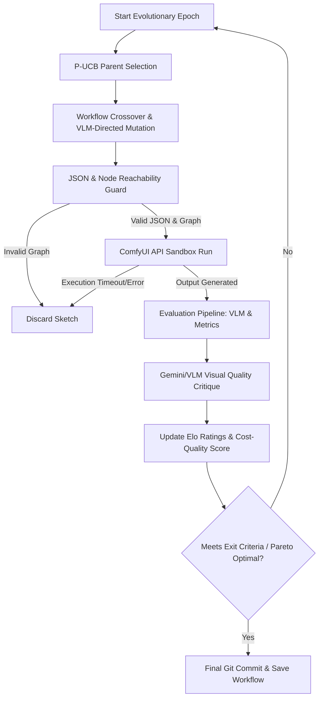

# JanusMaskJR — ComfyUI Workflow Evolution & Visual Testing Strategy

This report details how to adapt and extend **JanusMaskJR** (specifically its population-based evolutionary compilation package `autocompiler/` and verification framework) to automate the evolution, evaluation, and optimization of ComfyUI workflows. The goal is to evolve a workflow JSON structure that utilizes various image, LLM, and upscaling providers, dynamically optimizing for the best **quality-to-cost ratio**.

---

## 1. Architectural Overview & Workflow

The adapted system shifts JanusMaskJR's target output from Python/JS code to **ComfyUI Workflow JSON graphs**. The evolutionary loop operates in a task-scoped SQLite population database similar to the one defined in [nexus_integration_system_blueprint.md](file:///home/xnihil0zer0/JanusMaskJR/nexus_integration_system_blueprint.md).



The system runs asynchronously. The **autowork daemon** ([autowork_daemon.py](file:///home/xnihil0zer0/JanusMaskJR/harness/autowork_daemon.py)) orchestrates the workflow evolution by dispatching worker tasks to generate candidates, query APIs or local models, and test outputs.

---

## 2. Evolving ComfyUI Workflows: Crossover & Mutation

To evolve ComfyUI graphs programmatically, the workflow JSON is treated as the **genome** (chromosome). The genes represent both nodes (structural topology) and fields (parameters, samplers, checkpoints, prompts).

### A. Workflow Genome Representation
A ComfyUI workflow is a directed acyclic graph (DAG) represented as a JSON dictionary:
*   **Nodes:** The blocks performing operations (e.g., `KSampler`, `CheckpointLoaderSimple`, `UpscaleModelLoader`).
*   **Links / Edges:** Connections between node outputs and inputs (e.g., linking a latent output of `KSampler` to a `VAE Decode` node).
*   **Properties:** Internal parameter values (e.g., `seed`, `steps`, `cfg`, `denoise`, `upscale_method`).

### B. AST Crossover for Workflows (Sub-graph Splicing)
Unlike linear code, crossover on graph JSONs involves **sub-graph grafting**. We can adapt the crossover ideas from [nexus_integration_system_blueprint.md](file:///home/xnihil0zer0/JanusMaskJR/nexus_integration_system_blueprint.md#L297-L335) to perform structural splicing:
1.  **Identify Functional Sub-graphs:** Group nodes into modules (e.g., *Core Latent Generation*, *Face Detailing*, *High-Res Fix/Upscaling*, *LLM Prompt Augmentation*).
2.  **Splice Operator:** Select Parent A (e.g., high Elo rating for primary face generation) and Parent B (e.g., high Elo rating for sharp, cost-effective upscaling). Replace the upscaling sub-graph in Parent A with the upscaling sub-graph from Parent B.
3.  **Remap Links:** Reconnect boundary edges (e.g., the latent input of Parent B's upscaler connects to the latent output of Parent A's sampler).

### C. Directed Mutation via VLM Critique
Instead of purely random parameter sweeps, the **directed mutation engine** utilizes Vision-Language Models (VLMs) to guide the changes:
1.  An image is generated by the current workflow candidate.
2.  A local VLM (or cloud rater) analyzes the image and generates a **Visual Critique** (e.g., *"The image is sharp and detailed, but the background contains tiled patterns and upscaling noise, while the facial details are slightly blurry."*).
3.  A mutation planning agent receives the VLM critique, the current workflow JSON, and the parameter schema.
4.  The agent outputs target mutations to apply directly to the JSON:
    *   *Parameter tweak:* Set `denoise = 0.35` in the face detailer KSampler to sharpen the face.
    *   *Node replacement:* Swap the `RealESRGAN_x4plus` node for a `SUPIR` or `UltimateSDUpscale` node to eliminate tiling artifacts.
    *   *Node insertion:* Inject a `ControlNetTile` node to guide structure preservation.

---

## 3. Cost vs. Quality Optimization Matrix

The evolutionary harness optimizes for a multi-objective fitness function:

$$\text{Fitness} = w_1 \cdot \text{Quality} - w_2 \cdot \text{Cost} - w_3 \cdot \text{Latency}$$

Where:
*   $\text{Quality}$ is scored by the VLM (1–10) and aesthetic models.
*   $\text{Cost}$ is computed based on provider bills (unit economics).
*   $\text{Latency}$ is execution duration in seconds.

### Image Generation & Upscaling Provider Trade-offs

| Provider | Quality Level | Cost Profile | Latency (Speed) | Best Used For |
| :--- | :--- | :--- | :--- | :--- |
| **Fal.ai** | **Very High** (Flux, SDXL, clean upscalers) | Moderate (billed per GPU-second) | **Fastest** (~100-150ms startup) | High-speed, high-fidelity production pipelines |
| **Replicate** | **Very High** (flexible custom fine-tunes) | High (charged per-second of boot + run) | Moderate (cold-start overhead) | Prototyping custom or community-trained models |
| **Runware** | **Medium-High** (standard SDXL/Flux) | **Lowest Cloud Cost** (~$0.0006/gen) | Fast | Mass-scale generations where unit margins are tight |
| **Local SDXL/Flux** | **Unrestricted** (custom VAEs, custom nodes) | **Free** (marginal electricity/cooling cost) | Depends on local GPU load | Offline batch evolution, training, and privacy-first workflows |

### LLM/VLM Provider Trade-offs (Workflow Planners & Mutators)

| Provider | Reasoning / Coding Quality | Cost Profile (per 1M Tokens) | Latency | Key Trade-off / Fit |
| :--- | :--- | :--- | :--- | :--- |
| **Claude 3.5 Sonnet** | **Elite** (perfect JSON syntax) | High ($3.00 Input / $15.00 Output) | Moderate | Best for high-complexity structural mutation planning |
| **Gemini 2.5 Pro** | **Excellent** (huge context, superb vision) | Medium ($1.25 Input / $5.00 Output) | Moderate | Best for complex visual critiques of high-res images |
| **DeepSeek R1 / V3** | **Elite** (advanced reasoning & coding) | **Ultra-Low** ($0.14 Input / $0.28 Output cached) | Slow (high TTFT on R1) | **Recommended** cloud brain; 10x-20x cheaper than OpenAI/Anthropic |
| **Local LLMs (Qwen2.5)**| Medium | **Free** | Fast (on local hardware) | Good for simple, high-frequency parameter mutations |

---

## 4. Automated Testing & Local VLM Deployment

### A. Local VLM Strategy for Your GPU Setup
Your system features a mixed-GPU configuration:
*   **GPU 0:** NVIDIA GeForce RTX 3090 (24GB VRAM)
*   **GPU 1:** NVIDIA GeForce RTX 3060 (12GB VRAM)
*   **System RAM:** 94GB
*   **CPU:** AMD Ryzen 5 5600X (6-Core)

To achieve maximum visual quality with zero API cost, we deploy the closest to State-of-the-Art (SOTA) local VLMs.

#### **Model Recommendation**
1.  **Qwen2.5-VL-7B-Instruct (Highly Recommended for GPU 0):** 
    *   *Fit:* Extremely high accuracy in OCR, object detection, and visual detail extraction.
    *   *Deployment:* Run entirely in GPU 0 VRAM at FP16 or INT8 precision. It consumes ~8–14GB VRAM, leaving plenty of headroom (10–16GB) on the RTX 3090 for running ComfyUI generation (Stable Diffusion / Flux) concurrently.
2.  **InternVL2-26B / LLaVA-NeXT-34B (Split-GPU Deployment):**
    *   *Fit:* Larger parameter sizes provide superior reasoning and critique capabilities.
    *   *Deployment:* Run at INT4 quantization (`Q4_K_M`). The weights (~18-24GB) are split across both cards using **llama.cpp** or **Ollama**'s tensor split logic:
        *   Allocate **14GB** on GPU 0 (RTX 3090).
        *   Allocate **10GB** on GPU 1 (RTX 3060).
    *   *Caveat:* Because GPU 1 (RTX 3060) is significantly slower and has lower bandwidth than GPU 0 (RTX 3090), distributing layers across both creates a performance bottleneck during sequential attention calculations. However, keeping the model entirely in VRAM is still orders of magnitude faster than offloading layers to system RAM (CPU).

> [!IMPORTANT]  
> **72B VLMs (e.g., Qwen2-VL-72B):** Quantized to 4-bit, they require 40–45GB of VRAM. This exceeds your combined 36GB VRAM pool. Running them requires Q3 quantization or offloading layers to system RAM, which degrades latency to unusable speeds (~1-2 tokens/sec). Stick to the 7B–34B range for active evolution loops.

---

## 5. Image Analysis with Google Nanobanana

**Nanobanana** refers to Google’s native multimodal image generation and editing models within the Gemini ecosystem (e.g., `gemini-2.5-flash-image` and `gemini-3-pro-image-preview`). The evolutionary framework can leverage Nanobanana for image analysis and generation using two distinct execution paths.

### Path A: Antigravity-Driven Native Integration
In this path, the Antigravity developer agent uses direct API-based or local agent execution commands to communicate with Google's backend.
*   **Implementation:** Trigger Gemini API visual assessment calls directly from the test harness. Send the generated ComfyUI image alongside a structured JSON schema request.
*   **Example Prompt Structure:**
    ```json
    {
      "model": "gemini-2.5-pro",
      "response_mime_type": "application/json",
      "response_schema": {
        "type": "OBJECT",
        "properties": {
          "sharpness_rating": { "type": "INTEGER", "minimum": 1, "maximum": 10 },
          "aesthetic_score": { "type": "INTEGER", "minimum": 1, "maximum": 10 },
          "artifacts_detected": { "type": "BOOLEAN" },
          "artifact_description": { "type": "STRING" },
          "cost_benefit_verdict": { "type": "STRING", "enum": ["accept", "mutate", "discard"] }
        },
        "required": ["sharpness_rating", "aesthetic_score", "artifacts_detected", "artifact_description", "cost_benefit_verdict"]
      }
    }
    ```

### Path B: Playwright-Driven Gemini Browser Session
To avoid commercial API token billing, you can automate a browser session using **Playwright** to interact with Google AI Studio or the Gemini Web UI.
*   **Auth State Management:** Execute a manual login once to bypass Google's OAuth/2FA. Save the cookie and local storage state using Playwright:
    ```python
    context.storageState(path="state/auth/gemini_session.json")
    ```
*   **Browser Scraping Loop:**
    1.  Launch a chromium browser instance loading the saved session state:
        ```python
        context = browser.new_context(storage_state="state/auth/gemini_session.json")
        page = context.new_page()
        page.goto("https://aistudio.google.com/app/prompts/new_chat")
        ```
    2.  Locate the file upload button using Playwright selectors and upload the ComfyUI-generated image.
    3.  Type the evaluation prompt (asking for structured JSON output) into the prompt text area.
    4.  Click "Run" and wait for the model output elements to stop streaming, then extract the resulting text.
*   **Comparison of Paths:**

| Vector | Path A: Antigravity / Direct API | Path B: Playwright Browser Session |
| :--- | :--- | :--- |
| **Cost** | Paid (Per-token API pricing) | **Free** (Bypasses billing) |
| **Robustness** | **Ultra-Stable** (Guaranteed SLA) | Fragile (UI changes break selectors; bot detection) |
| **Throughput** | High (Highly parallelizable) | Low (Serial execution to avoid account flags) |
| **JSON Parsing** | Native via API parameters | Requires parsing text blocks out of raw HTML |

*Verdict:* Use **Path A (Direct API)** for the core evolutionary loop where speed and reliability are paramount. Use **Path B (Playwright)** for nightly batch evaluations or lower-frequency sanity checks.

---

## 6. Required Modifications to JanusMaskJR

To run this workflow evolution, we introduce light modifications to the JanusMaskJR engine. 

### A. Extend AST Enforcer to Validate JSON Graphs
The current AST Enforcer ([ast_enforcer.py](file:///home/xnihil0zer0/JanusMaskJR/harness/ast_enforcer.py)) enforces syntax validation on Python files. We add a new validator subclass, `JSONGraphEnforcer`, which:
1.  Parses the candidate workflow JSON.
2.  Ensures there are no cyclic loops (validates DAG properties).
3.  Ensures all required input nodes (e.g., source inputs, upscalers) link correctly to output nodes.
4.  Filters out forbidden nodes (such as execution loop-breakers or unsandboxed command executors).

### B. Sandbox Execution of ComfyUI
The Sandbox ([sandbox.py](file:///home/xnihil0zer0/JanusMaskJR/harness/sandbox.py)) currently runs Python code within bubblewrap. For ComfyUI:
1.  We implement a `ComfyUISandbox` that routes a ComfyUI JSON payload to a target ComfyUI server instance over HTTP/Websockets (`/prompt`).
2.  The sandbox catches execution timeouts, out-of-memory errors (OOMs), and missing node exceptions, translating them into standard failure logs.

### C. Update SQLite Population Schema
We update `population.db` (configured via [autocompiler.yaml](file:///home/xnihil0zer0/JanusMaskJR/config/autocompiler.yaml)) to store ComfyUI workflow metadata, keeping track of:
*   `cost_per_image`: API fees incurred or compute time.
*   `aesthetic_rating`: The score computed by the VLM.
*   `latency_ms`: Time taken to generate the image.

---

## 7. Action Plan for Implementation

```
   ┌─────────────────────────────────────────────────────────────┐
   │ 1. SETUP COMFYUI API CONNECTOR                              │
   │    - Build websocket client in harness/services/comfy.py     │
   └──────────────────────────────┬──────────────────────────────┘
                                  │
                                  ▼
   ┌─────────────────────────────────────────────────────────────┐
   │ 2. WRITE WORKFLOW MUTATOR & CROSSOVER OPERATORS             │
   │    - Adapt autocompiler/ to handle JSON node graphs         │
   └──────────────────────────────┬──────────────────────────────┘
                                  │
                                  ▼
   ┌─────────────────────────────────────────────────────────────┐
   │ 3. WIRE LOCAL VLM EVALUATOR                                 │
   │    - Configure Ollama split-GPU profiles in config/         │
   └──────────────────────────────┬──────────────────────────────┘
                                  │
                                  ▼
   ┌─────────────────────────────────────────────────────────────┐
   │ 4. STAGE AND EVOLVE WORKFLOW                                │
   │    - Write brief_hooks_comfy_evolution.md at project root   │
   └─────────────────────────────────────────────────────────────┘
```

1.  **Stage 1: ComfyUI Bridge:** Write a simple wrapper client in `harness/comfy_client.py` that submits a ComfyUI JSON graph to your local server, waits for the generation, and saves the output image.
2.  **Stage 2: Mutation Hooks:** Create a test module in `tests/e2e/test_comfy_evolution.py` containing a task oracle. The oracle specifies that the evolved workflow must generate an image with an aesthetic score $> 8.0$ and cost $< \$0.01$ per image.
3.  **Stage 3: Run the Autowork Daemon:** Allowlist the brief in `state/control/autowork/auto_promote.allowlist` and launch the daemon using `scripts/run-autowork.sh` to begin the evolutionary search.
