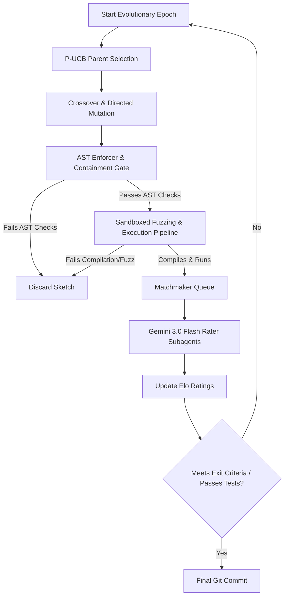

# JanusMaskJR — Nexus Integration System Blueprint: Population Search, AST Crossover, & Sandboxed Fuzzing

This blueprint provides the comprehensive system design and technical specifications for integrating DeepMind's **AlphaProof Nexus** ideas into **JanusMaskJR**. It transitions the tool from a linear, lock-step dual-agent loop to a robust, parallel population-based evolutionary search.

---

## 1. Architectural Overview & Workflow



The system runs asynchronously, utilizing a task-scoped SQLite database to track the evolution of code patches (sketches), schedule tournament matches, and run raters in parallel.

---

## 2. Shared Population Database & Matchmaker Queue

To coordinate concurrent generator and evaluator workers, JanusMaskJR implements a persistent task-scoped database at `state/sessions/{task_id}/population.db` utilizing Write-Ahead Logging (WAL). Physical patch contents are serialized as JSON files at `state/sessions/{task_id}/sketches/sketch_{sketch_id}.json`.

### A. SQLite Schema DDL
```sql
-- Represents individual code patch candidates (sketches) in the population
CREATE TABLE IF NOT EXISTS sketches (
    sketch_id TEXT PRIMARY KEY,
    task_id TEXT NOT NULL,
    parent_a_id TEXT,
    parent_b_id TEXT,
    source_agent TEXT NOT NULL,          -- 'claude', 'gemini', 'crossover', 'mutation'
    generation INTEGER DEFAULT 0,
    patch_file_path TEXT NOT NULL,       -- Path to patch JSON under state/sessions/{task_id}/sketches/
    elo_rating REAL DEFAULT 1200.0,
    match_count INTEGER DEFAULT 0,
    selection_count INTEGER DEFAULT 0,
    ast_valid INTEGER DEFAULT 0,         -- Boolean flag
    compiles INTEGER DEFAULT 0,          -- Boolean flag
    fuzz_fitness REAL DEFAULT 0.0,       -- Differential fuzz coverage / performance metric
    test_status TEXT DEFAULT 'pending',  -- 'pending', 'running', 'passed', 'failed'
    created_at REAL NOT NULL,
    metadata TEXT,                       -- JSON block storing model info, execution logs, etc.
    FOREIGN KEY (parent_a_id) REFERENCES sketches(sketch_id),
    FOREIGN KEY (parent_b_id) REFERENCES sketches(sketch_id)
);

CREATE INDEX IF NOT EXISTS idx_sketches_task_elo ON sketches(task_id, elo_rating DESC);
CREATE INDEX IF NOT EXISTS idx_sketches_selection ON sketches(task_id, selection_count);

-- Records tournament match outcomes evaluated by the rater subagents
CREATE TABLE IF NOT EXISTS matches (
    match_id INTEGER PRIMARY KEY AUTOINCREMENT,
    task_id TEXT NOT NULL,
    sketch_a_id TEXT NOT NULL,
    sketch_b_id TEXT NOT NULL,
    winner_id TEXT,                      -- NULL represents a draw/tie
    rater_model TEXT NOT NULL,           -- e.g., 'gemini-3.0-flash'
    rationale TEXT,                      -- Textual reasoning from the LLM
    created_at REAL NOT NULL,
    FOREIGN KEY (sketch_a_id) REFERENCES sketches(sketch_id),
    FOREIGN KEY (sketch_b_id) REFERENCES sketches(sketch_id)
);

-- Active queue driving pairwise tournament matchmaking
CREATE TABLE IF NOT EXISTS matchmaker_queue (
    match_id INTEGER PRIMARY KEY AUTOINCREMENT,
    task_id TEXT NOT NULL,
    sketch_a_id TEXT NOT NULL,
    sketch_b_id TEXT NOT NULL,
    status TEXT NOT NULL DEFAULT 'pending', -- 'pending', 'running', 'completed'
    assigned_worker TEXT,
    created_at REAL NOT NULL,
    updated_at REAL NOT NULL,
    FOREIGN KEY (sketch_a_id) REFERENCES sketches(sketch_id),
    FOREIGN KEY (sketch_b_id) REFERENCES sketches(sketch_id)
);

CREATE INDEX IF NOT EXISTS idx_matchmaker_pending ON matchmaker_queue(status, task_id);
```

### B. Concurrency-Safe Dequeue
```python
import sqlite3
import time

def dequeue_match(db_path: str, worker_id: str) -> dict | None:
    """Safely dequeue a pending tournament match under transaction lock."""
    conn = sqlite3.connect(db_path)
    conn.row_factory = sqlite3.Row
    try:
        with conn:
            conn.execute("BEGIN IMMEDIATE")
            cursor = conn.execute(
                """
                SELECT match_id, sketch_a_id, sketch_b_id 
                FROM matchmaker_queue 
                WHERE status = 'pending' 
                ORDER BY created_at ASC 
                LIMIT 1
                """
            )
            row = cursor.fetchone()
            if not row:
                return None
            
            match_id = row["match_id"]
            conn.execute(
                """
                UPDATE matchmaker_queue 
                SET status = 'running', assigned_worker = ?, updated_at = ?
                WHERE match_id = ?
                """,
                (worker_id, time.time(), match_id)
            )
            return {
                "match_id": match_id,
                "sketch_a_id": row["sketch_a_id"],
                "sketch_b_id": row["sketch_b_id"]
            }
    finally:
        conn.close()
```

### C. Elo Updates with Adaptive K-Factors
```python
def update_elo_ratings(
    rating_a: float, 
    rating_b: float, 
    winner: str, 
    matches_a: int, 
    matches_b: int
) -> tuple[float, float]:
    """Computes updated Elo ratings. Decays the K-factor as candidates gain matches."""
    expected_a = 1.0 / (1.0 + 10.0 ** ((rating_b - rating_a) / 400.0))
    expected_b = 1.0 / (1.0 + 10.0 ** ((rating_a - rating_b) / 400.0))
    
    if winner == "A":
        score_a, score_b = 1.0, 0.0
    elif winner == "B":
        score_a, score_b = 0.0, 1.0
    else:  # draw
        score_a, score_b = 0.5, 0.5
        
    k_a = 64.0 if matches_a < 5 else (32.0 if matches_a < 15 else 16.0)
    k_b = 64.0 if matches_b < 5 else (32.0 if matches_b < 15 else 16.0)
    
    new_rating_a = rating_a + k_a * (score_a - expected_a)
    new_rating_b = rating_b + k_b * (score_b - expected_b)
    
    return round(new_rating_a, 2), round(new_rating_b, 2)
```

### D. Parent Selection via P-UCB
```python
import math
import random

def select_parent_p_ucb(sketches: list[dict], exploration_const: float = 2.0) -> dict:
    """Selects parent sketch using Predictive Upper Confidence Bound."""
    if not sketches:
        raise ValueError("Cannot sample parent from empty population.")
        
    total_selections = sum(s["selection_count"] for s in sketches)
    best_score = -float("inf")
    selected_sketch = None
    
    for sketch in sketches:
        elo = sketch["elo_rating"]
        n_i = sketch["selection_count"]
        
        if total_selections == 0 or n_i == 0:
            ucb_score = elo + exploration_const * math.sqrt(math.log(total_selections + 2.0) / 1.0)
        else:
            ucb_score = elo + exploration_const * math.sqrt(math.log(total_selections) / n_i)
            
        if ucb_score > best_score:
            best_score = ucb_score
            selected_sketch = sketch
            
    return selected_sketch or random.choice(sketches)
```

### E. Gemini 3.0 Flash Rater Subagent Configuration
Rater models evaluate candidates side-by-side using structured JSON outputs:

```json
{
  "model": "gemini-3.0-flash",
  "temperature": 0.1,
  "response_mime_type": "application/json",
  "response_schema": {
    "type": "OBJECT",
    "properties": {
      "winner": {
        "type": "STRING",
        "enum": ["A", "B", "draw"],
        "description": "The candidate patch that is superior, or 'draw' if they are functionally and structurally identical."
      },
      "rationale": {
        "type": "STRING",
        "description": "Detailed multi-line explanation evaluating changes against correctness, AST safety, and diff minimality."
      },
      "minimality_rating_a": { "type": "INTEGER", "description": "1-10 rating of how clean/minimal Candidate A's patch is." },
      "minimality_rating_b": { "type": "INTEGER", "description": "1-10 rating of how clean/minimal Candidate B's patch is." },
      "safety_rating_a": { "type": "INTEGER", "description": "1-10 rating of Candidate A's code safety and logic structure." },
      "safety_rating_b": { "type": "INTEGER", "description": "1-10 rating of Candidate B's code safety and logic structure." }
    },
    "required": ["winner", "rationale", "minimality_rating_a", "minimality_rating_b", "safety_rating_a", "safety_rating_b"]
  }
}
```

#### Rater Prompt Template:
```markdown
You are a pairwise tournament rater for JanusMaskJR code patches.
Compare the following two patch candidates (Candidate A and Candidate B) written to satisfy the task objective.

### Task Objective & Requirements:
{{task_objective}}

### Files Touched:
{{files_touched}}

### Source File Contents (Original):
{{original_code}}

### Candidate A Patch:
```json
{{patch_a}}
```

### Candidate B Patch:
```json
{{patch_b}}
```

### Compiler & Test/Fuzz Signals:
* **Candidate A**: AST Valid: {{ast_valid_a}}, Compiles: {{compiles_a}}, Fuzz Score: {{fuzz_score_a}}
* **Candidate B**: AST Valid: {{ast_valid_b}}, Compiles: {{compiles_b}}, Fuzz Score: {{fuzz_score_b}}

### Evaluation Instructions:
Evaluate both patches side-by-side. Your decision must prioritize:
1. **Correctness & AST Safety**: Eliminate code introducing raw bare exceptions, unsafe module imports, stubbed mock returns, or logic bypasses.
2. **Diff Minimality**: Reward surgical modifications. Penalize candidates that unnecessarily rewrite large sections of unrelated helper methods.
3. **Robustness**: Reward elegant boundary handling (e.g. empty lists, overflow protection) demonstrated in differential fuzzer logs.
```

---

## 3. AST Crossover & Directed Mutation Engine

Using Python's standard `ast` module removes code comments and formatting, which breaks scaffolding comments. We transition our merging operations to use **Tree-sitter**, creating a Concrete Syntax Tree (CST) that preserves character offsets and syntax formatting.

### A. Tree-sitter Symbol Extraction
We run language-specific S-expression queries to map qualified symbols to byte offsets:

```python
PYTHON_QUERY = """
(class_definition 
  name: (identifier) @class.name) @class.node

(function_definition 
  name: (identifier) @function.name) @function.node
"""

JS_TS_QUERY = """
(class_definition 
  name: (identifier) @class.name) @class.node

(function_declaration 
  name: (identifier) @function.name) @function.node

(method_definition 
  name: (property_identifier) @function.name) @function.node

(lexical_declaration 
  (variable_declarator 
    name: (identifier) @function.name 
    value: (arrow_function))) @function.node
"""
```

### B. AST Crossover Splicing Algorithm
Splices are done in reverse byte order (descending by `start_byte`) to prevent modifications from shifting the offsets of preceding elements:

```python
def splice_ast_crossover(
    base_src: bytes, 
    parent_a_src: bytes, 
    parent_b_src: bytes, 
    symbols_base: dict, 
    symbols_a: dict, 
    symbols_b: dict
) -> bytes:
    """Recombines non-overlapping edits from two parent sources into the base source."""
    mod_a = {name for name, info in symbols_a.items() 
             if name not in symbols_base or info['hash'] != symbols_base[name]['hash']}
    mod_b = {name for name, info in symbols_b.items() 
             if name not in symbols_base or info['hash'] != symbols_base[name]['hash']}
    
    conflict = mod_a.intersection(mod_b)
    if conflict:
        # Fallback to Elo Selection: choose changes from the higher-rated parent
        raise ValueError(f"Crossover collision detected on symbols: {conflict}")
        
    edits = []
    for sym in mod_a:
        edits.append((symbols_base.get(sym), symbols_a[sym], parent_a_src))
    for sym in mod_b:
        edits.append((symbols_base.get(sym), symbols_b[sym], parent_b_src))
        
    # Sort descending by start_byte to maintain offsets
    edits.sort(key=lambda x: x[0]['start_byte'] if x[0] else float('inf'), reverse=True)
    
    result = bytearray(base_src)
    for base_info, src_info, parent_src in edits:
        replacement = parent_src[src_info['start_byte']:src_info['end_byte']]
        if base_info:
            sb, eb = base_info['start_byte'], base_info['end_byte']
            result[sb:eb] = replacement
        else:
            result.extend(b"\n\n" + replacement)
            
    return bytes(result)
```

### C. Directed Mutation Prompt Scaffolding
Fuzzer diagnostic errors are parsed to target the smallest containing Tree-sitter block for mutation.

```
You are an expert compiler optimization and repair subagent. 
Your task is to surgically mutate a target code block to fix a failing test/fuzz failure.

[TARGET CONTEXT]
File: {file_path}
Class: {class_name}
Symbol: {symbol_signature}

Original Code Block:
```python
{original_symbol_body}
```

[FAILURE DIAGNOSTICS]
{failure_traceback}

Differential Fuzzer Divergence (if applicable):
- Inputs: args={fuzz_args}, kwargs={fuzz_kwargs}
- Parent Output (Actual): {actual_output}
- Oracle Output (Expected): {expected_output}
- Divergence Reason: {divergence_reason}

[INSTRUCTIONS]
1. Rewrite ONLY the body of the target symbol. Do not change its signature.
2. Do not rewrite other methods or add global imports unless requested.
3. Preserve all scaffolding comments and directives.
4. Output your response as a single, valid markdown code block matching the target language.

Target replacement body:
```

---

## 4. AST-Level Write Containment & Anti-Stub Validation Gates

To ensure the agent works strictly inside designated regions and does not bypass tests using empty bodies or static mocks, we inject scaffolding checks and structural validation visitors into `harness/ast_enforcer.py`.

### A. Evolve Range Scaffolding Extraction
We scan comments using the standard `tokenize` module to map range boundaries:

```python
import io
import re
import tokenize
from dataclasses import dataclass
from typing import List, Optional

@dataclass
class EvolveRange:
    type: str  # "BLOCK" | "VALUE"
    start_line: int
    end_line: int
    metadata: Optional[str] = None

def extract_evolve_ranges(code: str) -> List[EvolveRange]:
    """Tokenize source code to find matching evolution scaffolding comments."""
    ranges: List[EvolveRange] = []
    stack: List[dict] = []
    
    tokens = tokenize.generate_tokens(io.StringIO(code).readline)
    for tok in tokens:
        if tok.type == tokenize.COMMENT:
            comment_text = tok.string.strip()
            
            if re.match(r'^#\s*JM-EVOLVE-BLOCK:\s*START', comment_text, re.IGNORECASE):
                stack.append({'type': 'BLOCK', 'start': tok.start[0], 'meta': None})
            elif m := re.match(r'^#\s*JM-EVOLVE-VALUE:\s*START(?:\s*\(([^)]+)\))?', comment_text, re.IGNORECASE):
                stack.append({'type': 'VALUE', 'start': tok.start[0], 'meta': m.group(1)})
            elif re.match(r'^#\s*JM-EVOLVE-BLOCK:\s*END', comment_text, re.IGNORECASE):
                if not stack or stack[-1]['type'] != 'BLOCK':
                    raise ValueError(f"Mismatched END block comment at line {tok.start[0]}")
                entry = stack.pop()
                ranges.append(EvolveRange('BLOCK', entry['start'], tok.start[0], entry['meta']))
            elif re.match(r'^#\s*JM-EVOLVE-VALUE:\s*END', comment_text, re.IGNORECASE):
                if not stack or stack[-1]['type'] != 'VALUE':
                    raise ValueError(f"Mismatched END value comment at line {tok.start[0]}")
                entry = stack.pop()
                ranges.append(EvolveRange('VALUE', entry['start'], tok.start[0], entry['meta']))
                
    if stack:
        raise ValueError(f"Unclosed evolution start comment at line {stack[-1]['start']}")
    return sorted(ranges, key=lambda r: r.start_line)
```

### B. Containment Verification via Placeholder Substitution
We replace evolution code ranges with a placeholder `__jm_evolve_placeholder()` and verify that the static AST regions of the original and modified source match exactly.

```python
import ast

def substitute_placeholders(code: str, ranges: List[EvolveRange]) -> str:
    lines = code.splitlines()
    new_lines = []
    last_idx = 0
    for r in ranges:
        new_lines.extend(lines[last_idx:r.start_line])
        start_comment_line = lines[r.start_line - 1]
        indent = len(start_comment_line) - len(start_comment_line.lstrip())
        new_lines.append(' ' * indent + '__jm_evolve_placeholder()')
        last_idx = r.end_line - 1
    new_lines.extend(lines[last_idx:])
    return '\n'.join(new_lines)

def compare_ast_nodes(n1: ast.AST, n2: ast.AST) -> bool:
    """Compare two AST nodes recursively, ignoring line/col offsets."""
    if type(n1) is not type(n2):
        return False
    for field in n1._fields:
        v1, v2 = getattr(n1, field, None), getattr(n2, field, None)
        if isinstance(v1, ast.AST):
            if not isinstance(v2, ast.AST) or not compare_ast_nodes(v1, v2):
                return False
        elif isinstance(v1, list):
            if not isinstance(v2, list) or len(v1) != len(v2):
                return False
            for item1, item2 in zip(v1, v2):
                if isinstance(item1, ast.AST):
                    if not isinstance(item2, ast.AST) or not compare_ast_nodes(item1, item2):
                        return False
                elif item1 != item2:
                    return False
        elif v1 != v2:
            return False
    return True
```

### C. Anti-Stub & Mock Detection Visitor
A custom AST visitor flags any candidate implementing empty routines, raising `NotImplementedError`, or returning static primitive mocks (e.g. `return True`) on parametrized signatures.

```python
from harness.ast_enforcer import Violation

class StubAndVacuityVisitor(ast.NodeVisitor):
    def __init__(self) -> None:
        self.violations: List[Violation] = []

    def _is_docstring(self, node: ast.stmt) -> bool:
        return isinstance(node, ast.Expr) and isinstance(node.value, ast.Constant) and isinstance(node.value.value, str)

    def _get_meaningful_body(self, body: List[ast.stmt]) -> List[ast.stmt]:
        return body[1:] if body and self._is_docstring(body[0]) else body

    def _is_empty_or_ellipsis(self, body: List[ast.stmt]) -> bool:
        meaningful = self._get_meaningful_body(body)
        if not meaningful:
            return True
        if len(meaningful) == 1:
            stmt = meaningful[0]
            if isinstance(stmt, ast.Pass):
                return True
            if isinstance(stmt, ast.Expr) and isinstance(stmt.value, ast.Constant) and stmt.value.value is Ellipsis:
                return True
        return False

    def _is_not_implemented_raise(self, body: List[ast.stmt]) -> bool:
        meaningful = self._get_meaningful_body(body)
        if len(meaningful) == 1:
            stmt = meaningful[0]
            if isinstance(stmt, ast.Raise):
                exc = stmt.exc
                if isinstance(exc, ast.Name) and exc.id == 'NotImplementedError':
                    return True
                if isinstance(exc, ast.Call) and isinstance(exc.func, ast.Name) and exc.func.id == 'NotImplementedError':
                    return True
        return False

    def _is_static_primitive_return(self, node: ast.FunctionDef | ast.AsyncFunctionDef) -> bool:
        params = [a.arg for a in node.args.posonlyargs + node.args.args + node.args.kwonlyargs]
        meaningful_params = [p for p in params if p not in ('self', 'cls')]
        if not meaningful_params:
            return False
            
        meaningful = self._get_meaningful_body(node.body)
        if len(meaningful) == 1:
            stmt = meaningful[0]
            if isinstance(stmt, ast.Return):
                val_node = stmt.value
                if val_node is None or isinstance(val_node, ast.Constant):
                    return True
        return False

    def visit_FunctionDef(self, node: ast.FunctionDef) -> None:
        self._check_node(node)
        self.generic_visit(node)

    def visit_AsyncFunctionDef(self, node: ast.AsyncFunctionDef) -> None:
        self._check_node(node)
        self.generic_visit(node)

    def _check_node(self, node: ast.FunctionDef | ast.AsyncFunctionDef) -> None:
        if self._is_empty_or_ellipsis(node.body):
            self.violations.append(Violation('stub_detected', 'error', node.lineno, f"'{node.name}' is empty."))
        elif self._is_not_implemented_raise(node.body):
            self.violations.append(Violation('stub_detected', 'error', node.lineno, f"'{node.name}' raises NotImplementedError."))
        elif self._is_static_primitive_return(node):
            self.violations.append(Violation('stub_detected', 'error', node.lineno, f"'{node.name}' returns static mock value."))
```

---

## 5. Multi-Language Sandboxed Verification & Fuzzing Pipeline

To extend verification to non-Python projects, the orchestrator parses parameters using S-expression queries, maps types to Python-based `hypothesis` strategies, and executes them inside isolated JavaScript or Python workers.

### A. JavaScript/TypeScript parameter query S-expressions
Tree-sitter TS queries extract parameter details:
```query
(function_declaration
  name: (identifier) @function_name
  parameters: (formal_parameters
    [
      (required_parameter
        pattern: (identifier) @param_name
        type: (type_annotation (_) @param_type)?)
      (optional_parameter
        pattern: (identifier) @param_name
        type: (type_annotation (_) @param_type)?)
      (assignment_pattern
        left: [
          (identifier) @param_name
          (required_parameter pattern: (identifier) @param_name type: (type_annotation (_) @param_type)?)
        ]
        right: (_) @param_default)
    ]*
  )
)
```

### B. Hypothesis Type Strategy Mapping Table

| JS/TS Type Annotation | Resolved Python Strategy | Notes / Constraints |
| :--- | :--- | :--- |
| `number` | `st.one_of(st.integers(min_value=-10000, max_value=10000), st.floats(allow_nan=False, allow_infinity=False))` | Maps to float/int boundary values |
| `string` | `st.text(alphabet=st.characters(categories=('L', 'N', 'P', 'Z')), min_size=0, max_size=100)` | Supports restricted alphanumeric if `fuzz_str_ascii` is true |
| `boolean` | `st.booleans()` | Boolean literals |
| `null` \| `undefined` | `st.none()` | Void representation |
| `any` \| `unknown` | `st.one_of(st.integers(), st.text(), st.booleans())` | Fallback strategy selection |
| `T[]` \| `Array<T>` | `st.lists(strategy_for(T), min_size=0, max_size=20)` | Lists of inner types |
| `Set<T>` | `st.sets(strategy_for(T), min_size=0, max_size=20)` | Unique collection generation |
| `Record<string, T>` \| `{[k: string]: T}` | `st.dictionaries(st.text(min_size=1, max_size=10), strategy_for(T), min_size=0, max_size=10)` | Maps key-value records |
| `{ k1: T1, k2: T2 }` | `st.fixed_dictionaries({"k1": strategy_for(T1), "k2": strategy_for(T2)})` | For inline object types |
| `T1 \| T2` (Union) | `st.one_of(strategy_for(T1), strategy_for(T2))` | Type unions |

### C. Persistent Sandboxed Node.js Bridge (`node_runner.js`)
Instead of spawning a new Node.js process for each test case, we stream length-prefixed JSON frames over standard pipes to a persistent sandbox process.

```javascript
/**
 * node_runner.js - Persistent Batch Runner for JS/TS Sandboxing
 */
const fs = require('fs');
const vm = require('vm');

let buffer = Buffer.alloc(0);

process.stdin.on('data', (chunk) => {
    buffer = Buffer.concat([buffer, chunk]);
    while (buffer.length >= 4) {
        const length = buffer.readUInt32BE(0);
        if (buffer.length >= length + 4) {
            const payloadBytes = buffer.subarray(4, length + 4);
            buffer = buffer.subarray(length + 4);
            handleBatch(payloadBytes);
        } else {
            break;
        }
    }
});

async function handleBatch(payloadBytes) {
    let payload;
    try {
        payload = JSON.parse(payloadBytes.toString('utf8'));
    } catch (e) {
        process.exit(1);
    }

    const { code, func_name, inputs, wall_timeout_per_input_sec } = payload;
    const timeoutMs = (wall_timeout_per_input_sec || 5.0) * 1000;

    let script;
    let compileError = null;
    try {
        script = new vm.Script(code, { filename: '<submission>' });
    } catch (e) {
        compileError = e;
    }

    if (compileError) {
        sendCompileError(inputs.length, compileError);
        return;
    }

    for (let i = 0; i < inputs.length; i++) {
        const input = inputs[i];
        const args = input.args || [];
        const result = await executeSingle(script, func_name, args, timeoutMs, i);
        sendFrame(result);
    }

    sendFrame({ status: "batch_done" });
}

async function executeSingle(script, funcName, args, timeoutMs, index) {
    const context = vm.createContext({
        console: { log: () => {}, error: () => {}, warn: () => {} },
        setTimeout,
        clearTimeout
    });

    const startTime = performance.now();
    try {
        script.runInContext(context);
        const target = context[funcName];

        if (typeof target !== 'function') {
            return {
                index,
                success: false,
                exception_type: 'TypeError',
                exception_message: `Function '${funcName}' is not defined.`
            };
        }

        const resultPromise = Promise.resolve(target(...args));
        const timeoutPromise = new Promise((_, reject) => 
            setTimeout(() => reject(new Error('TimeoutError')), timeoutMs)
        );

        const ret = await Promise.race([resultPromise, timeoutPromise]);
        const elapsed = performance.now() - startTime;

        return {
            index,
            success: true,
            return_value: ret,
            return_repr: typeof ret === 'object' ? JSON.stringify(ret) : String(ret),
            wall_time_ms: elapsed
        };

    } catch (err) {
        const elapsed = performance.now() - startTime;
        const isTimeout = err.message === 'TimeoutError';
        return {
            index,
            success: false,
            timed_out: isTimeout,
            exception_type: isTimeout ? 'TimeoutError' : (err.name || 'Error'),
            exception_message: err.message || String(err),
            wall_time_ms: elapsed
        };
    }
}

function sendFrame(obj) {
    const jsonStr = JSON.stringify(obj);
    const dataBuf = Buffer.from(jsonStr, 'utf8');
    const headerBuf = Buffer.alloc(4);
    headerBuf.writeUInt32BE(dataBuf.length, 0);
    process.stdout.write(headerBuf);
    process.stdout.write(dataBuf);
}

function sendCompileError(count, err) {
    for (let i = 0; i < count; i++) {
        sendFrame({
            index: i,
            success: false,
            exception_type: err.name || 'SyntaxError',
            exception_message: err.message || String(err),
            wall_time_ms: 0
        });
    }
    sendFrame({ status: "batch_done" });
}
```

### D. Sandboxed System Boundaries
To enforce the same safety constraints present in the Python sandbox:
1. **Network Namespace Isolation**: Host processes launch the node bridge using `unshare -n -r node node_runner.js`.
2. **Resource Caps**: Heap space is capped via Node's `--max-old-space-size=256` flag.
3. **Global Sandbox Limitations**: The `vm.createContext` excludes access to `process`, `require`, and filesystem APIs.

---

## 6. Concurrent SQLite Connection Pooling

SQLite in WAL mode supports high concurrency, but Python's standard `sqlite3` module requires explicit connection lifecycle management to avoid `database is locked` errors during parallel execution. We recommend a thread-local and process-aware connection manager:

```python
import sqlite3
import threading
import os
import contextlib

class SQLiteConnectionPool:
    """Thread-safe, process-aware connection pool for task SQLite databases.
    
    Provides thread-local connections to avoid sharing connections between threads,
    and handles process-boundary safety (re-initializing if forked).
    """
    
    def __init__(self, db_path: str, timeout: float = 10.0):
        self.db_path = db_path
        self.timeout = timeout
        self._local = threading.local()
        self._pid = os.getpid()

    def _get_conn(self) -> sqlite3.Connection:
        # Check if we have been forked
        current_pid = os.getpid()
        if current_pid != self._pid:
            # Fork detected, discard old connections and update pid
            self._local = threading.local()
            self._pid = current_pid

        if not getattr(self._local, "conn", None):
            # Create connection with busy timeout
            conn = sqlite3.connect(
                self.db_path, 
                timeout=self.timeout,
                isolation_level=None # Enable autocommit mode for manual transactions
            )
            # Configure database performance pragmas
            conn.execute("PRAGMA journal_mode=WAL;")
            conn.execute("PRAGMA busy_timeout=10000;")
            conn.execute("PRAGMA foreign_keys=ON;")
            conn.execute("PRAGMA synchronous=NORMAL;")
            conn.execute("PRAGMA cache_size=-64000;") # 64MB cache
            conn.row_factory = sqlite3.Row
            self._local.conn = conn
            
        return self._local.conn

    @contextlib.contextmanager
    def connection(self):
        """Context manager for obtaining a database connection."""
        conn = self._get_conn()
        yield conn

    @contextlib.contextmanager
    def transaction(self, mode: str = "IMMEDIATE"):
        """Context manager for database transactions.
        
        Uses BEGIN IMMEDIATE to prevent deadlock scenarios by acquiring a write lock
        before any writing starts.
        """
        conn = self._get_conn()
        conn.execute(f"BEGIN {mode}")
        try:
            yield conn
            conn.execute("COMMIT")
        except Exception:
            conn.execute("ROLLBACK")
            raise

    def close_local(self):
        """Closes the current thread's database connection."""
        if getattr(self._local, "conn", None):
            self._local.conn.close()
            self._local.conn = None
```

---

## 7. Workspace Makefile & Automation Setup

The workspace Makefile handles venv bootstrapping, pip package setup, Node.js sandboxed dependencies, Tree-sitter grammar generation, and testing hooks.

```makefile
# Makefile for JanusMaskJR Evolutionary Engine Integration

PYTHON := venv/bin/python
PIP := venv/bin/pip
PYTEST := venv/bin/pytest

.PHONY: all venv install-deps build-tree-sitter test clean lint

all: venv install-deps build-tree-sitter

venv:
	@echo "Creating virtual environment..."
	python3 -m venv venv
	$(PIP) install --upgrade pip setuptools wheel

install-deps: venv
	@echo "Installing python dependencies..."
	$(PIP) install -r requirements.txt
	@echo "Installing Node sandboxed dependencies..."
	cd webui && npm install || true

build-tree-sitter: install-deps
	@echo "Verifying Tree-sitter language modules..."
	$(PYTHON) -c "import tree_sitter, tree_sitter_python, tree_sitter_javascript, tree_sitter_typescript; print('Tree-sitter and languages imported successfully.')"

test: build-tree-sitter
	@echo "Running all unit and integration tests..."
	$(PYTEST) tests/ -v

lint: venv
	@echo "Running syntax check and lints..."
	$(PYTHON) -m flake8 harness/ || echo "Linting finished with warnings."

clean:
	@echo "Cleaning up generated cache and temporary folders..."
	rm -rf .pytest_cache .hypothesis build/ dist/ *.egg-info
	find . -type d -name "__pycache__" -exec rm -r {} +
	find . -type f -name "*.pyc" -delete
```

---

## 8. Harness Distillation & Constraint Auto-Synthesis

To exploit the difference in agent performance under varying metadata availability, JanusMaskJR implements a **Harness Distillation** pipeline. This system programmatically converts fluid prompt-level rules into hard, deterministic, and scripted verification checks (AST enforcer rules and dynamic fuzzer seeds), referencing the core design specifications detailed in the [Harness Distillation Framework Artifact](file:///home/xnihil0zer0/.gemini/antigravity-cli/brain/7de806d7-99e7-4d28-afbf-f2b13217c81e/harness_distillation_framework.md).

```
                                  +-----------------------------+
                                  |    Baseline Task Suite      |
                                  +-----------------------------+
                                                 |
                        +------------------------+------------------------+
                        v                                                 v
         +-----------------------------+                   +-----------------------------+
         |    Run With Full Metadata   |                   |   Run With Ablated Metadata |
         +-----------------------------+                   +-----------------------------+
                        |                                                 |
                        |   [Success Trace]                               |   [Failure Trace]
                        +------------------------+------------------------+
                                                 v
                                  +-----------------------------+
                                  |   Differential Trace Diff   |
                                  +-----------------------------+
                                                 |
                                                 v
                                  +-----------------------------+
                                  |  Heuristic Extraction (LLM) |
                                  +-----------------------------+
                                                 |
                                                 v
                                  +-----------------------------+
                                  |  Synthesis Engine (Python)  |
                                  +-----------------------------+
                                                 |
                        +------------------------+------------------------+
                        v (Static Checks)                                 v (Dynamic Checks)
         +-----------------------------+                   +-----------------------------+
         |   AST Enforcer Rules        |                   |   Fuzzer Strategy Seeds     |
         |   (ast_enforcer.py)             |                   |   (diff_fuzzer.py)              |
         +-----------------------------+                   +-----------------------------+
```

### A. The Distillation Loop
1. **Differential Trace Extraction**: Tasks are run under two parallel states:
   * **Trace A (Rich)**: Fully populated frontmatter markdown briefs, task JSON objectives, and multi-turn traceback compilation feedback.
   * **Trace B (Ablated)**: Stripped metadata files, generic objectives ("Implement the function"), and disabled traceback/fuzz error logs on retry loops.
2. **Heuristic Gap Identification**: The trace differences are analyzed. When Omitted Complexity or Bypasses are detected (e.g. returning constant values like `return True` or stubbing exceptions like `raise NotImplementedError` to pass type checkers), the gap is compiled.
3. **Constraint Compilation**:
   * **AST-Level**: The engine auto-synthesizes an `ast.NodeVisitor` subclass (e.g., custom `ASTVacuityChecker` rules) and appends it to [harness/ast_enforcer.py](file:///home/xnihil0zer0/JanusMaskJR/harness/ast_enforcer.py).
   * **Fuzzer-Level**: Inputs that caused the divergence in [harness/diff_fuzzer.py](file:///home/xnihil0zer0/JanusMaskJR/harness/diff_fuzzer.py) are extracted and appended to Hypothesis strategies (using `st.just()` overrides) or default search corpora (e.g. `_PATH_CORPUS`, `_AST_STMT_CORPUS`).

### B. Prototype Implementation Reference
A working prototype of the AST distillation parser and compiler has been verified at [autocompiler_research/distill_harness_rules.py](file:///home/xnihil0zer0/JanusMaskJR/autocompiler_research/distill_harness_rules.py). This script successfully parses the structural gaps between complex functions and static constant return stubs, outputting and storing compiled check rules (e.g., [autocompiler_research/synthesized_calculate_hash_digest_checker.py](file:///home/xnihil0zer0/JanusMaskJR/autocompiler_research/synthesized_calculate_hash_digest_checker.py)) directly into the workspace's validation flow.

---

## 9. Advanced Harness Optimizations: Verification & Architectural Addenda

These sections outline the adversarial verification, feasibility analyses, and concrete implementation designs for the four advanced performance and reliability layers.

### A. Adversarial Test Generation (Self-Audit GAN Loop)
*Reference detail document: [addendum_adversarial_testing.md](file:///home/xnihil0zer0/JanusMaskJR/autocompiler_research/addendum_adversarial_testing.md)*

To mitigate confirmation bias (circular validation) and semantic drift, where agents write code and tests that mutually agree on buggy behavior, JanusMaskJR implements a role-isolated test execution loop.
1. **Double-Directional Gating**: 
   * *Gate 1 (Ref Verification)*: The generated test suite must pass successfully when executed against the reference implementation in [harness/test_author.py](file:///home/xnihil0zer0/JanusMaskJR/harness/test_author.py#L58-L99).
   * *Gate 2 (Non-Vacuity / Mutant Verification)*: The test suite must fail when executed against a mutated stub version (using `stub_for` to generate `NotImplementedError` or primitive constant stubs).
2. **Adversarial Critic Loop**: The test suite is audited by an independent reviewer agent to ensure assertions verify concrete outputs (values, ranges, invariants) rather than simple type checking or truthiness.
3. **Execution Scoping**: Tests are registered as `test_<stem>_generated.py` and executed using target-scoped pytest `-k` patterns to prevent sibling dependencies from failing compilation.

### B. Deterministic Sandboxing (Flakiness Elimination)
*Reference detail document: [addendum_sandbox_determinism.md](file:///home/xnihil0zer0/JanusMaskJR/autocompiler_research/addendum_sandbox_determinism.md)*

To eliminate non-deterministic execution flakiness in Python/JS execution environments:
1. **Python-Level Mocks (`sitecustomize.py`)**: Written directly into the sandbox work directory to load automatically during startup.
   * *Clocks*: Intercepts standard clocks (`time.time`, `time.monotonic`, `datetime.datetime.now`) with a virtual clock that advances by a fixed step (e.g., 1ms) per call, fast-forwarding `time.sleep` deterministically.
   * *Entropy*: Seeds `random` and mocks `os.urandom` and `uuid` modules using a deterministic PRNG.
   * *Mocks & Sorting*: Overrides `id()` using an address-to-sequence map. Patches `os.listdir` and `os.scandir` to return alphabetically sorted outputs. Intercepts `socket` constructors to cleanly fail outbound connection calls with `ConnectionRefusedError`.
2. **Binary-Level Mocks (`LD_PRELOAD`)**: Hooks compiled libraries via a preloaded C helper (`libdeterminism.so`). Overrides syscall wrappers (`clock_gettime`, `getrandom`) and intercepts opens to `/dev/urandom` and `/dev/random` to redirect to a deterministic Xoshiro128** generator.
3. **Sandbox Integration**: Modifies [harness/sandbox.py](file:///home/xnihil0zer0/JanusMaskJR/harness/sandbox.py) to write `sitecustomize.py` to target folders during initialization and inject `LD_PRELOAD` in `sandbox_child_env`.

### C. Schema & Grammar-Constrained Decoding
*Reference detail document: [addendum_constrained_decoding.md](file:///home/xnihil0zer0/JanusMaskJR/autocompiler_research/addendum_constrained_decoding.md)*

To guarantee JSON formatting output structural validity from the provers:
1. **API Configuration**: Configures Gemini `response_schema` via the SDK using Pydantic models. A `"reasoning"` thought field is placed first in the schema to allow spatial planning before structured generation, mitigating prefill latency and cost overheads.
2. **Truncation & Exception Recovery**: Uses `json-repair` to dynamically rebuild JSON payloads cut off by output token limits (retaining only complete edit segments). Monitors step sampling; if token probabilities fall below $P < 0.01$ (log scarcity deadlock), the system aborts and falls back to unconstrained decoding.

### D. Semantic Loop Invariants & Assertions
*Reference detail document: [addendum_loop_invariants.md](file:///home/xnihil0zer0/JanusMaskJR/autocompiler_research/addendum_loop_invariants.md)*

To compile loop invariants directly into execution validation loops:
1. **Brief Invariant Parsing**: Planning briefs load YAML-based `loop_invariants` metadata (specifying target function, loop position, and expression) from the frontmatter.
2. **Automated Assertion Injection**: An `AssertionCompiler` (`ast.NodeTransformer`) injects the Python `assert` statement post-synthesis.
3. **AST Invariant Verification**: A `LoopInvariantEnforcer` (`ast.NodeVisitor`) in [harness/ast_enforcer.py](file:///home/xnihil0zer0/JanusMaskJR/harness/ast_enforcer.py) validates the AST structure, using unparsed canonical string comparison to prevent agents from deleting assertions to pass tests.


