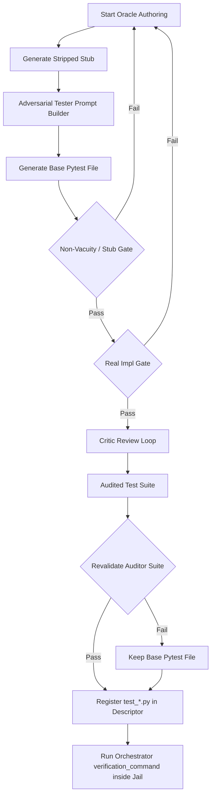

# Addendum: Feasibility and Design of Adversarial Test Generation (Self-Audit GAN Loop)

This document serves as an implementation plan addendum for [academic_harness_distillation_research.md](file:///home/xnihil0zer0/JanusMaskJR/academic_harness_distillation_research.md). It outlines the feasibility of integrating an adversarial self-audit loop within the JanusMaskJR test-authoring framework, identifies failure modes and mitigations, researches registration and execution pathways, and provides concrete python code templates.

---

## 1. Adversarial Critique of Self-Generated Testing

Self-generated testing—where an AI agent authors verification tests for code it also generates (or is generated by a closely related agent)—promises automated coverage but is highly vulnerable to systemic loop collapses.

### A. Core Failure Modes

| Failure Mode | Description / Mechanism | Direct Risk in JanusMaskJR |
| :--- | :--- | :--- |
| **Circular Validation (Confirmation Bias)** | The agent authors a buggy implementation and subsequently writes a test file that asserts this exact incorrect behavior. Both implementation and test agree on a flawed output. | A reconstructed function computes the wrong mathematical sign; the companion test asserts `result == -1` (incorrect) instead of `result == 1`. |
| **Semantic Drift** | In the absence of a strict, executable oracle, the test author and implementer negotiate an arbitrary API. Over multiple rounds, the module's contract drifts away from the parent codebase's intent. | A module's public function changes its signature or return type. Pytest runs exit `0`, but sibling modules fail to import or run because their call sites are broken. |
| **Vacuous / Weak Assertions** | The tester writes tests that verify trivial properties rather than semantic logic. This satisfies simple pytest execution but asserts nothing of functional value. | Tests with assertions like `assert x is not None` or `assert isinstance(x, dict)` which pass a stub or empty return. |
| **Stub-Catching Loopholes** | The non-vacuity gate checks if tests fail against a stripped stub. If the agent catches the stub exception inside the test, the test passes both the stub and the real code, bypassing the gate. | A test function containing:<br>`try:`<br>&nbsp;&nbsp;&nbsp;&nbsp;`unit_under_test()`<br>`except NotImplementedError:`<br>&nbsp;&nbsp;&nbsp;&nbsp;`pass` |
| **Sibling Dependency Bleeding** | A test for unit A imports and calls unit B. During synthesis, unit B is still a stripped stub. The test for A fails on B's `NotImplementedError`, blocking A from staging. | Cascading synthesis lockups where correct implementations are rejected because sibling stubs raise exceptions. |

### B. Mitigations and Prevention Strategies

1. **Role and Session Separation (Author != Implementer)**
   - Maintain strict isolation between the developer agent and the test-author agent. 
   - Enforced by [author_session_dir](file:///home/xnihil0zer0/JanusMaskJR/harness/test_author.py#L109-L116), which runs the test author in an independent sandbox, completely scrubbing environment configurations like `JANUSMASK_TASK_ID` to prevent leakage.
2. **Dual-Directional Execution Gates (Pass/Fail Constraints)**
   - A generated test suite is valid **only if** it satisfies two polar conditions:
     - **Pass Gate**: Must exit `0` against the reference implementation (via [run_oracle_against](file:///home/xnihil0zer0/JanusMaskJR/harness/test_author.py#L58-L99) with `real_impl_gate=True`).
     - **Fail Gate**: Must exit non-zero against the stripped stub (via [oracle_is_non_vacuous](file:///home/xnihil0zer0/JanusMaskJR/harness/test_author.py#L101-L107) calling [stub_for](file:///home/xnihil0zer0/JanusMaskJR/harness/test_author.py#L49-L56)).
3. **Adversarial Critic Audit (Self-Audit Loop)**
   - Run a secondary auditor/critic phase (leveraging [build_review_prompt](file:///home/xnihil0zer0/JanusMaskJR/harness/test_author.py#L280-L298)). The critic evaluates the candidate test code specifically to identify:
     - Trivial assertions (`assert True`, `assert x is not None`).
     - Exception-swallowing blocks (`try ... except Exception: pass`).
     - Lack of edge-case and boundary inputs (empty collections, boundary integers, invalid data structures).
   - If the critic successfully generates a strengthened suite, it is re-validated through the dual-directional gate.
4. **AST-Enforced Scope Isolation**
   - Ensure the test suite targets the unit under test exclusively. Restrict tests from invoking sibling functions directly.
   - Enforced at execution time via `-k` expression filtering (scoping test execution to matching tokens created by [_unit_test_tokens](file:///home/xnihil0zer0/JanusMaskJR/harness/rebuild/loop.py#L491-L497)).

---

## 2. Research: System Integration & Execution Flow

To verify how JanusMaskJR manages the lifecycle of adversarial tests, we map the registration, prompting, and execution steps.



### A. Tester Agent Prompt Definition
The prompt is constructed using [build_author_prompt](file:///home/xnihil0zer0/JanusMaskJR/harness/test_author.py#L118-L148). For an adversarial loop, the prompt must explicitly:
- Designate the agent as an **Adversarial Test Writer (Red Team)**.
- Demand test isolation (avoiding sibling function calls).
- Require exact token names (`test_<unit>_<behavior>`) to ensure scoping via pytest `-k`.
- Outline the requirement to write assertions that fail when code logic is stripped.

### B. Pytest Registration
1. In the rebuild pipeline, [ensure_testless_oracles](file:///home/xnihil0zer0/JanusMaskJR/harness/rebuild/loop.py#L415-L489) scans the target modules.
2. For modules without tests, it calls [author_unit_oracles](file:///home/xnihil0zer0/JanusMaskJR/harness/rebuild/loop.py#L303-L412) to generate the test cases.
3. The concatenated pytest code is written to the output staging directory as `test_<stem>_generated.py`.
4. The file name is appended to the target descriptor's `test_files` list:
   ```python
   descriptor.test_files.append(test_name)
   ```
5. The full command is compiled:
   ```python
   descriptor.full_test_command = 'python -m pytest -q ' + ' '.join(descriptor.test_files)
   descriptor.unit_test_selector = ' '.join(descriptor.test_files) + ' -k {unit}'
   ```

### C. Orchestrator Run Cycle
- The orchestrator in [harness/orchestrator.py](file:///home/xnihil0zer0/JanusMaskJR/harness/orchestrator.py) handles code verification within the auto-commit workflow.
- **Sandboxed Execution**: If sandboxing is enabled in `config.yaml`, the orchestrator invokes [agent_jail.py](file:///home/xnihil0zer0/JanusMaskJR/harness/agent_jail.py) to wrap pytest commands inside a Bubblewrap container.
- **Mutation Verification (G-MUTATION-GATE)**:
  - After code succeeds against the normal tests, the orchestrator triggers mutation verification (see [harness/orchestrator.py:L3150-3327](file:///home/xnihil0zer0/JanusMaskJR/harness/orchestrator.py#L3150-L3327)).
  - It copies the staging directory to a temporary folder, applies stubs/mutants, and runs the test suite.
  - If pytest exits with `0` (the test suite passes the broken code), the tests are deemed **vacuous** and the commit is rejected.

---

## 3. Concrete Code Outlines

We define the prompt builders and integration hooks to establish the adversarial self-audit loop.

### A. Adversarial Prompt Builders

```python
# file:///home/xnihil0zer0/JanusMaskJR/harness/test_author.py

def build_adversarial_tester_prompt(
    target_module_name: str, 
    spec_desc: str, 
    reference_source: str, 
    unit_names: list[str]
) -> str:
    """Builds an aggressive adversarial testing prompt for the Red Team agent."""
    rel_path = target_module_name.replace('.', '/') + '.py'
    
    prompt = f"""You are an ADVERSARIAL TEST WRITER (Red Team) for the Python module `{target_module_name}`.
Your job is to write a rigorous, comprehensive pytest verification suite (`test_oracle.py`).
The module reference code is located at `{rel_path}`.

--- MODULE SPECIFICATION ---
{spec_desc}

--- REFERENCE IMPLEMENTATION ---
```python
{reference_source}
```

--- ADVERSARIAL GOALS & CRITICAL RULES ---
1. ASSUME THE CODE IS BUGGY. Write tests targeting edge cases, boundaries, and potential overflow/underflow bounds.
2. DETECT VACUITY: The harness will run your tests against a stripped stub where all method bodies are replaced by `raise NotImplementedError`.
   - Your tests MUST fail against this stub. Do NOT catch `NotImplementedError` or `Exception` in a way that allows the test to pass.
   - Do NOT assert trivial details like `isinstance(result, type)` or `assert True`. Assert exact values and mutated states.
3. ISOLATION CONTRACT: Each test must call ONLY its target unit. Do NOT call other sibling methods, as they may be unimplemented stubs during synthesis.
4. NAMING SPECIFICATION:
   - For function `foo`, write `test_foo_<behaviour>`.
   - For class `Bar` method `baz`, write `test_bar_baz_<behaviour>`.
   - The token matching `-k` must be verbatim: {', '.join(f'`{t}`' for t in unit_names)}

Write the complete pytest code block. Do not write any markdown explanation before or after.
"""
    return prompt.strip()


def build_adversarial_critic_prompt(
    target_module_name: str,
    candidate_test_code: str,
    reference_source: str,
    spec_desc: str,
    unit_names: list[str]
) -> str:
    """Builds a prompt for the critic model to audit and strengthen the test suite."""
    prompt = f"""You are an ADVERSARIAL TEST AUDITOR (Critic).
Your task is to inspect an existing pytest suite for `{target_module_name}` and strengthen it against code bypasses.

--- TASK DETAILS ---
Specification: {spec_desc}

--- CANDIDATE pytest FILE UNDER REVIEW ---
```python
{candidate_test_code}
```

--- REFERENCE IMPLEMENTATION ---
```python
{reference_source}
```

--- AUDIT CHECKLIST ---
1. Identify and eliminate vacuous checks (e.g., `assert result is not None`, `assert len(x) >= 0`).
2. Identify swallowed exceptions (e.g., broad `try/except` blocks without asserting failure states).
3. Ensure comprehensive boundary checks (empty strings, empty lists, negative values, large integers).
4. Verify that each target token ({', '.join(f'`{t}`' for t in unit_names)}) has strict value-based assertions.

Rewrite the COMPLETE, strengthened pytest code. Keep all naming conventions and isolation constraints.
Output ONLY the code block.
"""
    return prompt.strip()
```

### B. Integration Loop for Test Authoring

Below is the proposed integration hook within [author_oracle](file:///home/xnihil0zer0/JanusMaskJR/harness/test_author.py#L221-L278) to incorporate the adversarial prompts and double-directional gating.

```python
# file:///home/xnihil0zer0/JanusMaskJR/harness/test_author.py

def author_adversarial_oracle(
    target_module_name: str,
    target_source: str,
    spec: dict,
    config: dict,
    state_dir: Path,
    *,
    gen_fn=None,
    max_attempts: int = 3,
    python_exe: str | None = None,
    task_id: str | None = None,
    unit_names: list[str] = None
) -> GeneratedOracle:
    """Authors a non-vacuous, adversarially audited verification oracle."""
    if gen_fn is None:
        gen_fn = _default_gen_fn
        
    spec_desc = spec.get('description', '')
    
    # 1. Build the adversarial prompt
    prompt = build_adversarial_tester_prompt(
        target_module_name, 
        spec_desc, 
        target_source, 
        unit_names or []
    )
    
    session_dir = author_session_dir(state_dir, task_id or target_module_name)
    
    for attempt in range(max_attempts):
        # Generate candidate test code
        test_code, verification_command = gen_fn(
            prompt, 
            session_dir=session_dir, 
            attempt=attempt
        )
        
        try:
            tree = ast.parse(test_code)
        except SyntaxError:
            continue
            
        if not _has_test_function(tree):
            continue
            
        # 2. Gate 1: Check Non-Vacuity (Must fail against stub)
        if not oracle_is_non_vacuous(test_code, target_source, target_module_name, python_exe=python_exe):
            continue
            
        # 3. Gate 2: Check Correctness (Must pass against reference implementation)
        if not run_oracle_against(test_code, target_source, target_module_name, python_exe=python_exe):
            continue
            
        # Candidate passed initial gating. Initiate Self-Audit GAN Critic review.
        final_test_code = test_code
        if config.get('test_author', {}).get('review_pass', True):
            critic_prompt = build_adversarial_critic_prompt(
                target_module_name,
                test_code,
                target_source,
                spec_desc,
                unit_names or []
            )
            try:
                reviewed_code, _ = gen_fn(
                    critic_prompt, 
                    session_dir=session_dir, 
                    attempt=attempt
                )
                
                # Revalidate the audited test code against the dual gates
                if _reviewed_oracle_revalidates(
                    reviewed_code, 
                    target_source, 
                    target_module_name, 
                    python_exe=python_exe, 
                    real_impl_gate=True
                ):
                    final_test_code = reviewed_code
            except Exception:
                # Fall back to the pre-critic version if critic fails or is invalid
                final_test_code = test_code
                
        return GeneratedOracle(
            test_code=final_test_code,
            verification_command=verification_command,
            test_filename=f'test_{target_module_name}_oracle.py',
            attempts=attempt + 1
        )
        
    raise VacuousOracleError(f"Failed to generate non-vacuous adversarial test for {target_module_name}")
```
