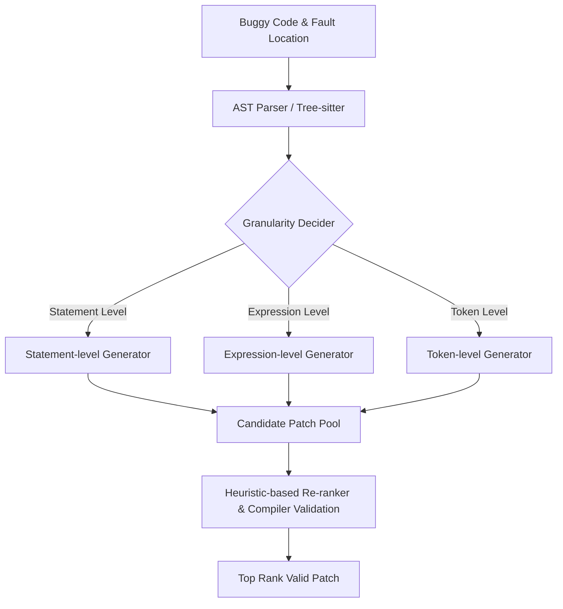

# Paper Summary: One Size Does Not Fit All: Multi-granularity Patch Generation for Better Automated Program Repair (Mulpor)

- **Authors:** Bo Lin, Shangwen Wang, Ming Wen, Liqian Chen, Xiaoguang Mao
- **Venue:** 33rd ACM SIGSOFT International Symposium on Software Testing and Analysis (ISSTA 2024) - **ACM SIGSOFT Distinguished Paper Award**
- **PDF Link:** [mulpor.pdf](file:///home/xnihil0zer0/JanusMaskJR/autocompiler_research/mulpor.pdf)
- **Official Preprint:** [ISSTA-24.pdf](https://shangwenwang.github.io/files/ISSTA-24.pdf)

---

## 1. Core Objective & Motivation
Traditional Automated Program Repair (APR) techniques generated patches using a single fixed level of granularity (typically at the statement level, such as replacing a whole statement, or the hunk level). However, real-world software bugs are highly diverse:
1. Some bugs are simple spelling errors or incorrect arithmetic operators (**Token-level**).
2. Some bugs require modifying a sub-expression like a conditional check inside an `if` statement (**Expression-level**).
3. Some bugs require adding, deleting, or swapping complete lines of code (**Statement-level**).

Using a single-granularity repair tool for all bugs leads to sub-optimal fixes:
- Statement-level tools introduce unnecessary noise or rewrite too much context for small typos.
- Token-level tools cannot synthesize complex multi-line logic.

**Mulpor** (Multi-granularity Patch Generator) solves this by training and executing three specialized generators targeting statement, expression, and token levels. It then aggregates and filters proposals using a ranking system to find the optimal patch.

---

## 2. Key Architecture & Methodology

### A. Three Granularity Generators
Mulpor utilizes three distinct models (based on the T5 transformer architecture) fine-tuned for specific granularities:
- **Statement-level Generator:** Focuses on statement-level modifications. The context supplied includes the enclosing block, and the target is the full statement.
- **Expression-level Generator:** Modifies expression-level nodes (e.g., boolean conditions, function call arguments, variable assignments). The context highlights the specific expression in the statement.
- **Token-level Generator:** Replaces individual tokens (e.g., logical/comparison operators, variables, constants).

### B. Unsupervised Pre-training with Syntactic Awareness
Before fine-tuning on bug datasets, the models undergo pre-training tasks that are syntactically informed:
- The model parses code into ASTs.
- It masks spans that correspond strictly to AST subtrees representing statements, expressions, or tokens.
- This teaches the model to understand syntactic boundaries and program structures.

### C. Heuristic-Based Re-ranking & Validation
Once candidates are generated from the three models:
1. **Compilation Filtering:** Invalid syntax and failing-compilation patches are eliminated.
2. **Re-ranking:** Mulpor ranks the remaining candidate patches using heuristics like structural similarity, probability scores from the generator models, and size of the edit (prioritizing smaller, precise edits first).

---

## 3. Key Findings & Performance
- **Evaluation Benchmark:** Evaluated on **Defects4J** and **VulRepair+**.
- **Results:**
  - Mulpor out-performed existing state-of-the-art DL-based APR tools.
  - Multi-granularity patch generation successfully fixed many bugs that single-granularity tools missed.
  - The AST-guided pre-training greatly increased the percentage of syntactically compilable patches generated by the network.

---

## 4. Relevance to JanusMaskJR Agentic Compilation
1. **Scope-Targeted Prompts (Granularity):** Instead of giving an LLM agent the entire file and asking for a fix, JanusMaskJR can use a parser to classify the issue and specify the target granularity:
   - *Token-level:* Fixes to constants, operators, or simple identifiers.
   - *Expression-level:* Fixes to conditional clauses or function parameters.
   - *Statement-level:* Inserting/replacing blocks.
2. **Hierarchical AST-masking for Context:** When providing context to the agent, we can mask out irrelevant parts of the code at AST boundaries (e.g., collapse nested loops or other methods that are not relevant to the bug location), keeping the context size small and focused.
3. **Multi-candidate Aggregation:** We can run the agent in parallel with different prompts (one requesting an expression edit, another a statement edit), compile/test the candidates, and rank the results, mirroring Mulpor's aggregation strategy.
