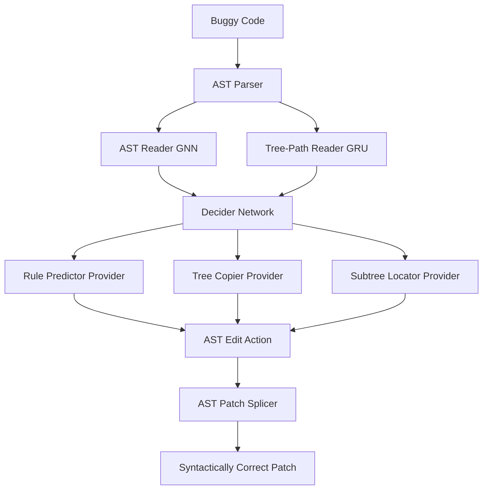

# Paper Summary: A Syntax-Guided Edit Decoder for Neural Program Repair (Recoder)

- **Authors:** Qihao Zhu, Zeyu Sun, Yuan-an Yuan, Yingfei Xiong, Lu Zhang, Kangsha Zhang
- **Venue:** ACM Joint European Software Engineering Conference and Symposium on the Foundations of Software Engineering (ESEC/FSE 2021)
- **PDF Link:** [recoder.pdf](file:///home/xnihil0zer0/JanusMaskJR/autocompiler_research/recoder.pdf)
- **arXiv Source:** [arXiv:2106.08253](https://arxiv.org/abs/2106.08253)

---

## 1. Core Objective & Motivation
Traditional deep learning-based automated program repair (APR) models typically adopt sequence-to-sequence (Seq2Seq) architectures, generating patch code token-by-token. This approach has three major limitations:
1. **Syntactic Correctness:** Standard token decoders have no inherent understanding of the language's grammar rules, resulting in many syntactically invalid patches.
2. **Edit Representation Inefficiency:** Seq2Seq models often rewrite entire statements or methods to perform small edits, increasing the search space and likelihood of error.
3. **Out-of-Vocabulary (OOV) Identifiers:** Generating project-specific variables or method names (which are not present in the training set) is extremely challenging.

**Recoder** addresses these problems by generating **AST-level edit actions** (instead of raw code) and using a **syntax-guided decoding architecture** to guarantee that the generated code is syntactically correct and properly integrated.

---

## 2. Key Architecture & Methodology

### A. Provider/Decider Architecture
Recoder splits the patch generation process into a central controller (the **Decider**) and specialized modules (the **Providers**):
- **The Decider:** Evaluates the current decoding state (e.g., current path in the tree, partial patch) and decides which provider to query.
- **Rule Predictor:** Recommends grammar production rules (e.g., converting an `Expr` node into a `MethodCall` or `Literal`) to build syntactically valid AST branches.
- **Tree Copier:** Reuses existing identifiers and subtrees from the surrounding context (the buggy method/class), which handles the OOV identifier problem.
- **Subtree Locator:** Determines the precise coordinates of the code in the buggy context to copy.

### B. Edit-Based Syntax-Guided Generation
Instead of rebuilding the program from scratch, Recoder models patch generation as a sequence of AST edits:
- **Insert:** Inserts a new AST subtree at a target location.
- **Delete:** Removes an existing AST subtree.
- **Replace:** Swaps a buggy AST node/subtree with a new one.

During decoding, the generation is constrained by the programming language's context-free grammar. Non-terminal nodes are recursively expanded using only valid grammar rules.

### C. Placeholder Mechanism
To handle names/identifiers unique to the project, Recoder emits generic **placeholders** during the generation phase. These placeholders are mapped back to concrete local/class scope variables during a post-processing matching step, ensuring that variables and method names are syntactically and semantically correct in the scope of the bug.

---

## 3. Key Findings & Performance
- **Benchmark Evaluation:** Evaluated on the widely used **Defects4J (v1.2 & v2.0)** benchmark.
- **Results:**
  - On Defects4J v1.2, Recoder correctly fixed **53 bugs**, representing a **26.2% improvement** over the previous state-of-the-art tool (TBar).
  - On Defects4J v2.0, Recoder fixed **19 bugs** (outperforming TBar's 8 and SimFix's 2).
- **First of its Kind:** It was one of the first deep-learning-based APR models to outperform traditional, template-based APR tools on Defects4J.

---

## 4. Relevance to JanusMaskJR Agentic Compilation
1. **AST-Level Splicing:** Rather than prompting an LLM to rewrite a whole file (which is error-prone and consumes high token overhead), JanusMaskJR can extract the AST of the buggy method, let the agent specify the exact AST nodes to edit, and then surgically splice the new nodes.
2. **Tree-sitter Integration:** Tree-sitter's fast CST/AST parser can be used to construct the tree paths and validate grammar production rules in real-time as edits are applied, mimicking Recoder's syntax-guided constraints.
3. **Identifier Scoping:** When synthesizing fixes, the agent can be supplied with a "symbol provider" (extracted via Tree-sitter or compiler diagnostics) to resolve placeholders or match variable types correctly within the local block scope.
