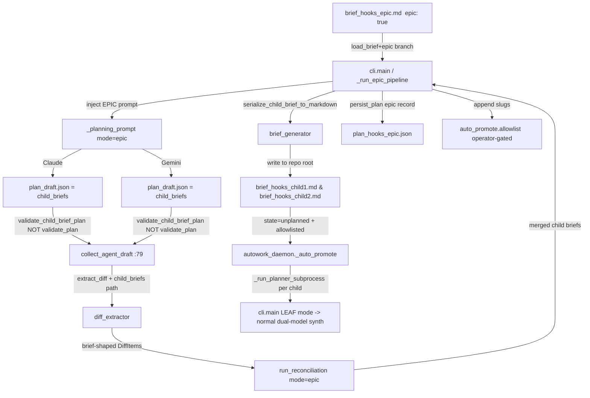

# Area B — The Decomposer Core (Dual-Model Differential Decomposition) — VERIFIED

> Adversarial review of `gemini_area_B_decomposer_core.md`. Every anchor, symbol,
> and feasibility tag below was checked against the source at the repo state on
> 2026-06-05. Corrections and gaps are flagged inline and consolidated in §9.

## 1. Summary

Area B turns one high-level **epic** brief into N **child briefs**, and the
NON-NEGOTIABLE rule is that *the decomposition itself* must pass through the same
dual-model blind-draft + reconciliation that leaf-task synthesis uses.

The Gemini draft's headline claim — "just reuse `blind_draft` / `diff_extractor`
/ `reconciliation` by adding a few helpers" — is **only partially feasible**. The
three modules are reusable at the *orchestration* layer (spawn two agents,
collect two JSON artifacts, diff them, take stances, merge), but they are
**hard-coupled to the leaf-task JSON schema at four concrete chokepoints** that
the draft did not identify:

1. `harness/planner/plan_validator.py:validate_plan` is invoked **twice** in the
   pipeline (inside `collect_agent_draft` at `blind_draft.py:79`, and at the tail
   of `cli.main` at `cli.py:195`). It hard-rejects any artifact that is not a
   full leaf-task object (requires `meta_task_type`, `test_spec` with 4 test
   arrays, `token_budget_ratio`, `attribution_metadata`, etc.). A child-brief
   draft has none of these → it is silently dropped as `invalid`. **This is the
   single biggest blocker and the draft never mentions it.**
2. The blind-draft and reconciliation **prompts are hard-coded inline f-strings**
   inside the functions (`blind_draft.py:135`, `reconciliation.py:101`), not
   files in `prompts/`. There is no prompt-file loader to "select."
3. `diff_model.FieldKind` is a **closed Enum** (scope/priority/tests/dependencies/
   files_touched/edge_cases/non_goals) and `DiffItem` hashes identity on
   `task_id`; matching keys on `files_touched` + `title`. Briefs have neither
   `files_touched` nor `task_id` in that shape.
4. There is **no epic-vs-leaf branch anywhere** in the codebase, and
   `PlanningBrief` is a `frozen=True` dataclass with a fixed required-section set
   — there is no `epic` field (the draft's `brief.epic` is hallucinated).

Reconciliation (`reconciliation.py`) is the *least* coupled — it deep-copies the
competing artifact dicts opaquely and only reads `meta_task_type` for the
tiebreaker — so it generalizes with the least surgery.

The good news the draft *under*-sold: the **re-entry seam already exists and is
automatic**. Any `brief_hooks_<slug>.md` written to repo root with **no**
matching `plan_hooks_<slug>.json` is reported as state `unplanned` by
`compute_brief_status` (`brief_status.py:23`), and the daemon's `_auto_promote`
runs the full planner on exactly one such brief per tick via
`_run_planner_subprocess` (`autowork_daemon.py:1138`, kicked at
`autowork_daemon.py:1411`). So child briefs do **not** need the selfheal
pre-synthesis pattern — they get re-planned through the normal dual-model leaf
pipeline for free, *provided the allowlist contains their slugs*.

## 2. Existing Substrate (CORRECTED anchors)

- **`harness/planner/blind_draft.py`**
  - `run_blind_drafts(brief, config, state_dir) -> BlindDraftResult`
    — **`blind_draft.py:116-155`** ✅ (range confirmed). It spawns both agents via
    `run_both_agents`, but the planning prompt is a **hard-coded inline f-string at
    `:135`** — there is no static prompt file and no prompt-selection seam. It also
    writes a fixed `brief.json` shape at `:122` (title/scope/non_goals/inputs/
    deliverables/raw_text/source_path/sha256 — no epic/interfaces fields).
  - `collect_agent_draft(...)` **`:44-83`** calls `_validate_plan(draft)` at
    **`:79`** and returns `(None, 'invalid')` on any violation. **Load-bearing for
    Area B**: this is where a child-brief-shaped draft dies.
- **`harness/planner/diff_extractor.py`**
  - `extract_diff(claude_plan, gemini_plan) -> PlanDiff` — **`:110-261`** ✅.
    Reads `claude_plan.get("tasks", [])` / `gemini_plan.get("tasks", [])`, keys
    matching on `task_id` (`:124,131`) then heuristics on `files_touched` Jaccard +
    `title` ratio (`:86-108`).
  - `_compare_fields(claude_task, gemini_task)` — **`:19-84`** (the draft cited
    `:22`, which is merely the first line *inside* the body). Reads `spec.objective`,
    `spec.functional_requirements`, `priority`, `dependencies`, `files_touched`,
    `spec.edge_cases`, `spec.non_goals`, and `test_spec` (4 arrays). **Deeply
    leaf-coupled.**
- **`harness/planner/diff_model.py`** (the draft omitted this file entirely)
  - `FieldKind` (closed Enum, `:14-21`), `DiffItem` (frozen, hashes on `task_id`
    via `__post_init__` at `:34-64`), `PlanDiff` (`:66-111`). Field names
    `claude_task`/`gemini_task` are baked into the dataclass and its JSON round-trip.
- **`harness/planner/reconciliation.py`**
  - `run_reconciliation(diff, claude_draft, gemini_draft, config, state_dir) ->
    ReconciliationResult` — **`:57-239`** ✅. Prompt is a **hard-coded string literal
    at `:101`** (the draft cited `:99`, off by 2). Output field is `merged_tasks`
    (`ReconciliationResult.merged_tasks`, `:21`). Merges by deep-copying
    `item.claude_task`/`item.gemini_task` opaquely — artifact-agnostic except the
    `meta_task_type` tiebreaker read at `:207-211`.
- **`harness/planner/cli.py`**
  - `persist_plan(plan, out_path, brief_obj=None)` — **`:86-106`** (draft cited
    `:94`, which is `_emit_planner_lifecycle('persist_plan')`). Top-level function.
    It writes the plan JSON and injects `source_brief_path`/`sha256`/`working_dir`
    — it does **not** know about child briefs, and no child-brief data reaches it
    today because `main` hard-builds `merged_plan = {'tasks': stamped_tasks}` (`:185`)
    and validates it at `:195`.
- **`harness/selfheal.py`**
  - `_synthesize_selfheal_plan(repo_root, state_dir, task_id, brief_path)` —
    **`:50-131`** ✅.
  - `_harvest_selfheal_briefs(state_dir, repo_root, config)` —
    **`:225-415`** (draft said `225-414`; off-by-one tail). Harvests
    `brief_hooks_<id>_fix.md` → copies to `brief_hooks_selfheal_<id>.md` **AND**
    pre-synthesizes `plan_hooks_selfheal_<id>.json` (so the planner is *bypassed*
    for selfheal). Mints an HMAC provenance marker (`:279-303`) and evicts blocked
    sidecars. **This is a different mechanism from what Area B wants** (see §3).
- **Re-entry seam (the draft under-specified this):**
  - `brief_status.compute_brief_status` (`brief_status.py:4-75`): a `brief_hooks_*`
    with no plan = `unplanned`.
  - `autowork_daemon._auto_promote` (`:1205+`) picks ≤1 `unplanned` brief/tick and
    calls `_run_planner_subprocess` (`:1138`, command at `:1139` =
    `python -m harness.planner.cli <brief> --output-plan plan_hooks_<slug>.json`),
    kicked at `:1411`.
  - Eligibility is gated by `compute_autowork_eligibility` (`brief_status.py:77`):
    the slug **must be in `state/control/autowork/auto_promote.allowlist`**, else
    `not_in_allowlist`/`allowlist_missing` and it is never planned.

## 3. Required Changes (CORRECTED tags + new blockers)

| # | Change | True Anchor | New/Modify | Viability Tag | Touches harness/? | Notes |
|:--|:--|:--|:--|:--|:--|:--|
| B1 | **Epic detection** — add an `epic` (bool) + optional `child_brief_count_hint` to `PlanningBrief` and to `REQUIRED`/`_optional` parsing | `brief_loader.py:26-37` (dataclass), `:67` (REQUIRED), `:158` (`_optional`), `:187-211` | Modify | **YELLOW** — `PlanningBrief` is `frozen=True`; adding a field + frontmatter normalization touches 3 spots in one module. Top-level (no class methods). | Yes | The draft's `brief.epic` does not exist today. Frozen-dataclass field add is mechanical but multi-spot. |
| B2 | **Epic-vs-leaf branch** in the planner driver: when `brief.epic`, run the decomposition pipeline (epic prompt + brief-diff + brief-recon + child-brief validator) and emit `plan_hooks_<epic>.json` whose payload is the *epic plan record* + write child `brief_hooks_*.md` | `cli.py:108-199` (`main`) | Modify | **RED-ish** — `main` is a 90-line top-level function; AST symbol-patch of a function this size risks truncation (see MEMORY: large-symbol-truncates). Prefer extracting an `_run_epic_pipeline()` helper (GREEN new symbol) and branching to it. | Yes | **MISSING entirely from the draft.** Without this branch nothing routes an epic brief differently. |
| B3 | **Bypass/replace `validate_plan` for child-brief artifacts** — a `validate_child_brief_plan` (or a `mode=` param on collection) so `collect_agent_draft` and the final `cli.main` validation accept brief-shaped drafts | `blind_draft.py:79`, `plan_validator.py:60`, `cli.py:195` | New fn + Modify call sites | **YELLOW** — `validate_plan`/`_validate_plan` are top-level (GREEN to add a sibling), but the **call sites** are inside `collect_agent_draft` (`:44-83`) and `main`. Threading a mode flag through `run_blind_drafts → collect_agent_draft` touches a top-level function body. | Yes | **#1 BLOCKER, omitted by draft.** Without it the dual-model decomposition drafts are dropped as `invalid` at `:79` and never reach diff/reconciliation. |
| B4 | **Generalize `run_blind_drafts` to inject the epic prompt** | `blind_draft.py:116-155` (prompt literal at `:135`) | Modify | **YELLOW** — top-level function (not a class method, so not RED-zone), BUT it is large and the prompt is a huge inline f-string; symbol-patching it risks truncation. Safer: extract `_planning_prompt(brief, mode)` helper (GREEN new fn) and call it. | Yes | Draft's "dynamic prompt selection at `:128`" is wrong-anchored (`:128` is the `agents` env loop). Prompt is at `:135`. There is no prompt *file* to select. |
| B5 | **Generalize diff matching to child briefs** — add a `child_briefs` array path + brief identity key (`brief_id`/`slug`) | `diff_extractor.py:110` (`extract_diff`), `:86` (`_get_match_reason_and_score`) | Modify | **YELLOW multi-symbol** ✅ (draft tag correct). Both are top-level functions. | Yes | Must add a stable `brief_id`/`slug` key (see §5) and a `deliverables`/`scope`-based match heuristic since briefs have no `files_touched`. |
| B6 | **`_compare_brief_fields` helper** + extend `FieldKind` Enum | `diff_extractor.py:19` (sibling of `_compare_fields`), `diff_model.py:14-21` (`FieldKind`) | New fn + Modify Enum | **GREEN new fn** for the helper; **YELLOW** for the `FieldKind` Enum widening (must add `scope_text`/`deliverables`/`interfaces`/`inputs` members — the closed Enum is consumed by `DiffItem.__post_init__` hashing and `PlanDiff.from_json`). | Yes | Draft tagged this GREEN single-symbol and missed the Enum-extension coupling. |
| B7 | **`DiffItem` identity for briefs** — make `__post_init__` fall back to `brief_id`/`slug` when `task_id` absent | `diff_model.py:34-64` | Modify | **GREEN single-symbol** (top-level dataclass method `__post_init__` of a *frozen dataclass*, edited as a whole-symbol patch — confirm it patches cleanly; dataclass method, not a class-instance method on a stateful object). | Yes | Omitted by draft. Without it, two child briefs with empty `task_id` hash to colliding ids. |
| B8 | **Brief-level reconciliation** — generalize prompt + keep `merged_tasks` opaque | `reconciliation.py:101` (prompt), `:57-239` | Modify | **YELLOW** — top-level function but large; prefer extracting `_reconciliation_prompt(mode)` (GREEN new fn). Body is already artifact-agnostic except `meta_task_type` read at `:207-211` (briefs lack it → tiebreaker degrades to `flag_for_human`, acceptable). | Yes | Draft cited `:99`; actual prompt literal is `:101`. |
| B9 | **`brief_generator.serialize_child_brief_to_markdown(brief_data) -> str`** | new file `harness/planner/brief_generator.py` | New file | **GREEN new-file** ✅. | Yes | Output MUST satisfy `brief_loader.load_brief` (required sections title/scope/non_goals/inputs/deliverables + frontmatter for `dependencies`/`interfaces`), or the re-planned child brief fails to load (exit 3). |
| B10 | **Persist child briefs + register slugs** — in the epic-pipeline helper (B2), write `brief_hooks_<child_slug>.md` to repo root AND append child slugs to `auto_promote.allowlist` (or document that the operator must) | `cli.py` epic helper; `state/control/autowork/auto_promote.allowlist` | New code | **YELLOW** — file writes are GREEN, but auto-appending to the allowlist is a **security-gated** action (the allowlist is the autonomy trust root; see MEMORY: operator-decision gating). | Yes | Draft put this in `persist_plan` at `:94`. `persist_plan` is the wrong seam — it only gets `(plan, out_path, brief_obj)` and no child-brief list. Do it in the epic helper. |
| B11 | **New prompt files** `prompts/epic_decomposition_prompt.md`, `prompts/epic_reconciliation_prompt.md` + a tiny loader | `prompts/` (only `critique_prompt.md` exists today) | New files + loader | **GREEN (config-ish)** for the files; the loader is a GREEN new fn. | Yes | Note: today **no prompt loader exists**; prompts are inline. B4/B8 must introduce the loader, so these files are inert until then. |

## 4. New Symbols / New Files (corrected)

- `harness/planner/prompts/epic_decomposition_prompt.md` — instructs both models
  to draft **child briefs** (frontmatter with `slug`, `dependencies`, `interfaces`;
  body sections Title/Scope/Non-Goals/Inputs/Deliverables). Inert until a loader
  (B4) reads it. **GREEN config.**
- `harness/planner/prompts/epic_reconciliation_prompt.md` — stance prompt for
  divergent child-brief definitions. Inert until B8 loader. **GREEN config.**
- `harness/planner/brief_generator.py` —
  `def serialize_child_brief_to_markdown(brief_data: dict) -> str:` returns Markdown
  whose required sections + frontmatter pass `load_brief`. **GREEN new-file.**
  (Draft named it `serialize_brief_object_to_markdown`; rename for clarity; either
  is GREEN.)
- `harness/planner/plan_validator.py:validate_child_brief_plan(plan) -> list` — a
  sibling validator with the *brief* schema. **GREEN new fn**, but its call-site
  wiring (B3) is YELLOW.
- `_planning_prompt(brief, mode)` / `_reconciliation_prompt(mode)` extracted
  helpers — **GREEN new fns** that de-risk B4/B8 from large-symbol truncation.

## 5. Data-Flow / Sequence (corrected)

Key correction vs the draft's diagram: child briefs are **re-planned through the
normal LEAF pipeline** (full blind-draft/diff/reconciliation on tasks), NOT
discovered-and-bypassed like selfheal. The daemon only re-plans them if their
slug is in the allowlist (`compute_autowork_eligibility`).

### Static interface authoring (verified mechanics)
1. Sibling ordering: child-brief **frontmatter** carries `dependencies: [child_1]`.
   This must survive `brief_generator` → `load_brief` → re-planning. **Caveat:**
   `PlanningBrief` does NOT parse `dependencies` today (only working_dir is
   optional-frontmatter). The dependency edge actually has to be re-expressed as a
   `dependencies` field on the *leaf tasks* that the child brief is planned into,
   or carried in the epic plan record. The draft's "child_2 frontmatter points to
   child_1" is not honored by the current loader — **gap, see §9**.
2. Frozen interfaces: child_1's brief Deliverables says "x.py exposes
   `func_y(a:int)->str`"; child_2's brief Inputs/Interfaces restates the same
   signature as static text. This is just prose in the brief body — feasible, but
   nothing *validates* the two strings agree (Level 2; the draft correctly defers
   schema-matching to Level 2).
3. Ordering enforcement at runtime is via the leaf-task `dependencies` DAG that
   the daemon already honors — confirmed (`stage_task` + dependency gating exist),
   but only AFTER the dependency edge is materialized onto leaf tasks (gap above).

## 6. Dependencies & Ordering

- **Level 1 (this feature):** B1 epic field, B2 epic branch (+ `_run_epic_pipeline`
  helper), B3 child-brief validator + wiring (THE blocker), B4 epic prompt
  injection (+ `_planning_prompt` helper), B5/B6/B7 brief-diff generalization +
  `FieldKind` widening, B8 brief reconciliation, B9 `brief_generator`, B10 child
  persist + slug registration, B11 prompt files + loader.
- **Level 2 (deferred):** interface-string agreement validation across dependent
  briefs; auto-derivation of `dependencies` from interface references; multi-level
  (N>1) recursion; allowlist auto-append automation under operator policy.

## 7. Risks, Red-Zones, Open Questions

- **Validator coupling (NEW, highest):** `validate_plan` runs at `blind_draft.py:79`
  and `cli.py:195`. If B3 is not done first, the entire dual-model decomposition is
  invisible (drafts dropped as `invalid`). This is the make-or-break for the
  "reuse the machinery" claim.
- **Large-symbol truncation:** `run_blind_drafts`, `run_reconciliation`, and
  `cli.main` are large top-level functions; per MEMORY, AST symbol-patches of large
  functions truncate. Mitigate by extracting GREEN helper functions rather than
  patching the giants in place.
- **`FieldKind` is a closed Enum** consumed by hashing + JSON round-trip
  (`diff_model.py`). Widening it is mechanical but touches `__post_init__` and
  `from_json`. Missed by the draft.
- **Allowlist trust root:** child slugs must be allowlisted for the daemon to
  re-plan them. Auto-appending is a security-gated operator decision (MEMORY:
  `_NEVER_AUTO_APPROVE`, operator decision files). Do NOT silently mutate the
  allowlist on the autonomous path.
- **Dependency edge loss:** child-brief frontmatter `dependencies` is not parsed
  by `load_brief`; the edge must be re-projected onto leaf tasks or carried in the
  epic plan record. Open design question.
- **Diff ambiguity on prose (draft's point, still valid):** briefs are
  prose-heavy and have no `files_touched`; matching must lean on a stable
  `brief_id`/`slug` (forced by the epic prompt) plus a scope/deliverables text
  ratio. Without a forced stable slug, `_is_near_miss`/ambiguous-match rates spike.
- **DAG depth (draft's point, valid):** depth budget enforcement; Level 1 caps at
  one decomposition layer per the design rule.

## 8. Anchor Appendix (VERIFIED)

- `run_blind_drafts` — `harness/planner/blind_draft.py:116-155` ✅ (prompt literal `:135`)
- `collect_agent_draft` (validator chokepoint) — `blind_draft.py:44-83` (validate at `:79`)
- `extract_diff` — `harness/planner/diff_extractor.py:110-261` ✅
- `_compare_fields` — `diff_extractor.py:19-84` (draft said `:22`)
- `FieldKind` / `DiffItem` — `harness/planner/diff_model.py:14-21` / `:23-64`
- `run_reconciliation` — `harness/planner/reconciliation.py:57-239` ✅ (prompt `:101`, draft said `:99`)
- `persist_plan` — `harness/planner/cli.py:86-106` (draft said `:94`); `main` `:108-199`; final `validate_plan` `:195`
- `PlanningBrief` (frozen, no `epic`) — `harness/planner/brief_loader.py:26-37`; REQUIRED `:67`; `_optional` `:158`
- `validate_plan` (leaf schema, hard gate) — `harness/planner/plan_validator.py:60`; required leaf fields `:21,32,40`
- `_synthesize_selfheal_plan` — `harness/selfheal.py:50-131` ✅
- `_harvest_selfheal_briefs` — `harness/selfheal.py:225-415` (draft said `225-414`)
- Re-entry seam — `harness/brief_status.py:23` (`unplanned`), `compute_autowork_eligibility:77` (allowlist gate); `harness/autowork_daemon.py:1138` (`_run_planner_subprocess`), `:1139` (planner command), `:1411` (kickoff)

## 9. Adversarial Review Findings

**Wrong anchors corrected**
- `_compare_fields` is `diff_extractor.py:19-84`, not `:22`. (confidence: high)
- `run_reconciliation` prompt literal is `:101`, not `:99`. (high)
- `persist_plan` is `cli.py:86-106`; `:94` is `_emit_planner_lifecycle('persist_plan')`. (high)
- `run_blind_drafts` prompt injection point is `:135` (inline f-string), not `:128`
  (which is the per-agent env loop). (high)
- `_harvest_selfheal_briefs` ends at `:415`, not `:414`. (high)
- `run_blind_drafts :116-155`, `extract_diff :110-261`, `run_reconciliation :57-239`,
  `_synthesize_selfheal_plan :50-131` — these four ranges in the draft are CORRECT. (high)

**Hallucinations / false premises**
- `brief.epic` flag — **does not exist**. `PlanningBrief` is `frozen=True` with a
  fixed required-section set and only `working_dir` optional. Adding `epic` is real
  work (B1), not a flag read. (high)
- `spec.interfaces` "during decomposition" — briefs have **no `spec`**; only
  generated *leaf tasks* have a `spec`. Child-brief interfaces live in brief body
  prose / frontmatter, not `spec.interfaces`. (high)
- "static prompt" / "inject the epic decomposition prompt instead of the task
  prompt" implies a prompt-file selection mechanism. **None exists** — both prompts
  are hard-coded inline; a loader must be built first (B4/B11). (high)
- Child briefs "Discovered by Autowork Daemon → PlannerCLI" is correct in spirit
  but the draft conflated it with the selfheal flow. Selfheal **pre-synthesizes a
  plan and bypasses the planner**; child briefs must be left **planless** so the
  daemon re-plans them. Also requires allowlisting. (high)

**Mis-tagged viability**
- "Compare brief fields" tagged GREEN single-symbol: the helper is GREEN, but it
  forces a **`FieldKind` Enum widening** (closed Enum consumed by hashing +
  JSON round-trip) that the draft missed → effectively YELLOW. (high)
- "Write child briefs in `persist_plan`" — wrong seam; `persist_plan` never
  receives child-brief data. Belongs in the epic-pipeline branch (B2/B10). (high)
- `run_blind_drafts`/`run_reconciliation`/`cli.main` are all top-level (NOT
  class-method RED-zone), so the draft's GREEN-on-the-class-axis instinct holds —
  but they are **large symbols** where AST patches truncate (MEMORY), so the
  *practical* tag is YELLOW unless helpers are extracted. (med-high)

**Gaps filled**
- **The decisive gap:** `validate_plan` is a hard gate at TWO points
  (`blind_draft.py:79`, `cli.py:195`) and rejects brief-shaped artifacts. The
  "reuse the machinery" claim is therefore **NOT free** — it requires a parallel
  child-brief validator + mode threading (B3). Without it, decomposition drafts are
  dropped before diff/reconciliation. (high — this is the heart of Area B)
- **No epic-vs-leaf branch exists** anywhere; B2 must add one (preferably a new
  helper to avoid patching `main`). (high)
- **Stable child-brief id/slug** must be forced by the prompt for diff matching to
  work, and `DiffItem.__post_init__` must fall back to it (B7). (high)
- **Dependency edges in child-brief frontmatter are not parsed** by `load_brief`;
  they must be re-projected onto leaf tasks or carried in the epic plan record. (med)
- **Allowlist registration** is required for re-planning and is a security-gated
  operator action — not a silent write. (high)

**Net verdict on "reuse the dual-model machinery"**
- **Reconciliation:** genuinely reusable with a prompt swap (artifact-opaque
  merge). FEASIBLE.
- **blind_draft orchestration:** reusable, but blocked by the inline prompt and the
  `validate_plan` chokepoint. FEASIBLE only after B3 + B4.
- **diff_extractor / diff_model:** reusable *structure*, but task-coupled at
  `_compare_fields`, the `files_touched`/`title` match heuristic, the closed
  `FieldKind` Enum, and `task_id` hashing. Needs real generalization (B5/B6/B7),
  not "a helper." PARTIALLY FEASIBLE.
- **plan_validator:** NOT reusable for briefs; needs a sibling validator. The draft
  ignored it entirely — this is the single biggest correction.
