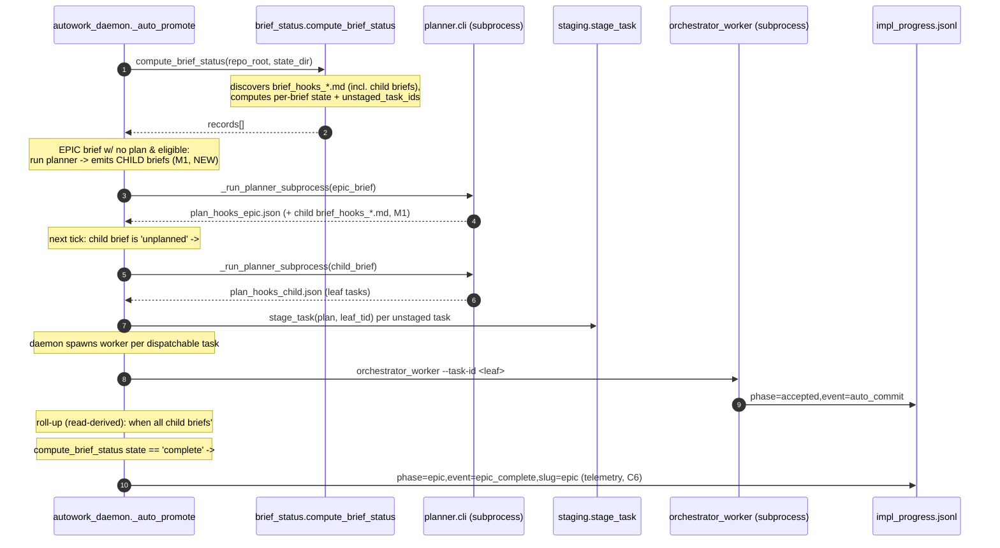

# Area C — Dispatch, Staging, Execution & Completion Roll-Up (VERIFIED)

> Adversarial re-verification of `gemini_area_C_dispatch_staging_rollup.md` against actual
> source at HEAD. Every line anchor below was re-confirmed by reading the file. Anchors that
> the Gemini draft got wrong are corrected inline and itemized in §9. **Headline: 0 of the 6
> proposed edits land in class methods — the draft's "class-method RED-ZONE" warning is a
> phantom. The real feasibility hazard is large-function partial-edit truncation (`_auto_promote`
> ~230 lines, `_auto_commit_accepted` ~430 lines) plus a misconceived dispatch interceptor.**

## 1. Summary

Area C is the plumbing that lets an *epic brief* decompose into *child briefs* that re-enter
the planner, get their leaf tasks staged/dispatched, and roll completion back up to the parent.

The single most important architectural correction to the Gemini draft: **a "child brief" in
this codebase is naturally a `brief_hooks_<slug>.md` file, NOT a queued task.** The daemon's
existing `_auto_promote` / `compute_brief_status` loop *already* auto-discovers every
`brief_hooks_*.md`, runs the planner on unplanned ones (`_run_planner_subprocess`), and stages
the resulting leaf tasks. Therefore the draft's central mechanism — "intercept a queued task in
`orchestrator.py` and redirect it to the planner CLI" — is **not the right seam and not needed**
for the daemon (autonomous) path. The recursion happens for free at the brief layer. The only
genuinely new plumbing is: (a) recognizing a brief as an *epic* and emitting its child briefs,
(b) depth-guarding the brief→child-brief recursion, and (c) a roll-up that marks a parent epic
`complete`/`blocked` once its children resolve.

There is **no pre-existing `epic` / `parent_epic` / `child_brief` / `sub_brief` / `epic_complete`
machinery anywhere** in `harness/` or `scripts/` (grep-confirmed). This is entirely greenfield.

## 2. Existing Substrate (corrected anchors)

- **`harness/autowork_daemon.py`** (2574 lines, **NO top-level classes**):
  - `_auto_promote` — **`autowork_daemon.py:1204`** (top-level `def`, spans ~1204–1480; the
    draft's `L1204-1487` is close). Stages unstaged plan tasks via `stage_task` (the `for tid in
    unstaged:` loop begins at **:1333**) and kicks off the planner on **at most one** `unplanned`
    brief via `_run_planner_subprocess` (**:1411**). Already calls `compute_brief_status` (:1223,
    :1256) and `_harvest_selfheal_briefs` (:1249).
  - Staging-dependency gate: **`autowork_daemon.py:1346-1359`** (`STAGING_DEP_GATE`, builds
    `_accepted` from the ledger at :1302-1324 and a `_dep_map` at :1325-1332). The draft's
    `L1350-1358` is essentially correct.
  - `collect_dispatchable_tasks` — **`autowork_daemon.py:174`** (top-level). Returns ready task
    dicts from `<state_dir>/tasks/`, accumulating accepted ids from the ledger (:198) — the
    draft omitted this function from §2 entirely.
- **`harness/brief_status.py`** (133 lines):
  - `compute_brief_status` — **`brief_status.py:4-75`** (top-level; draft said `L4-75` ✓). Globs
    `repo_root/brief_hooks_*.md`, maps each to `plan_hooks_<slug>.json`, and computes a per-brief
    `state` ∈ {`unplanned`, `planned`, `blocked`, `in_flight`, `complete`, `zombie`, `queued`}
    (decision ladder at **:57-70**) plus `unstaged_task_ids` (:72). **This `state` ladder is the
    real completion-rollup substrate** — not `autowork_daemon.py`.
  - ⚠️ **The Gemini draft mis-scoped `compute_brief_status` to `autowork_daemon.py` in the task
    scope, but correctly placed it in `brief_status.py` in §2.** It lives ONLY in `brief_status.py`
    and is imported into the daemon at `autowork_daemon.py:19`.
- **`harness/orchestrator.py`** (4196 lines; classes present but irrelevant to Area C):
  - `get_next_task` — **`orchestrator.py:1249`** (top-level; draft said `L1249-1354` ✓, spans
    1249–1354). Claims the oldest unprocessed `tasks/*.json`, enforces a dependency gate
    (`if deps:` at **:1307**), runs `check_true_depth` (**:1313**), renames to `.json.processing`,
    returns the task dict (`return task` at **:1354**).
  - The dispatch *loop* is in `run_pipeline` — **`orchestrator.py:3244`** (top-level), with
    `task = get_next_task(state_dir)` at **:3279**. Routing classification is centralized in
    `_should_bypass_or_route_task` — **`orchestrator.py:3203`** (top-level helper, returns
    `'route'|'bypass'|'fuzz'`).
  - The **real autonomous dispatch path is NOT `run_pipeline`** — the daemon spawns
    `python -m harness.orchestrator_worker --task-id <tid>` as a subprocess
    (`autowork_daemon.py:987` and `:1715`). `orchestrator_worker.main` is at
    `orchestrator_worker.py:116` (top-level).
  - The acceptance / completion signal `{'phase':'accepted','event':'auto_commit',...}` is
    written by `_auto_commit_accepted` — **`orchestrator.py:2150`** (top-level), row emitted at
    **:3073**.
- **`harness/depth_validator.py`** (74 lines):
  - `check_true_depth` — **`depth_validator.py:6`** (top-level; draft said `L6-75` ✓, file is 74
    lines). Walks `parent_task` then falls back to `parent_task_id` (**:61-65**), counting depth,
    cycle-guarded (visited set), `max_depth=3`. Looks parents up in `tasks_dir/` then
    `tasks_dir/processed/`. **Does NOT inspect `parent_epic` today** — draft is correct that this
    is the gap.
- **`harness/task_decomposer.py`** (471 lines):
  - `Subtask` dataclass — **`task_decomposer.py:33-41`**: fields `task_id`, `parent_task_id`,
    `specification`, `constraints`, `depends_on` (default `[]`), `depth` (default `0`).
  - `enqueue_subtasks` — **`task_decomposer.py:330`**: writes `state_dir/tasks/<id>.json` with
    top-level keys `task_id`, **`parent_task`** (note: written as `parent_task`, matching what
    `check_true_depth` reads), `specification`, `constraints`, `depends_on`, `depth`. Draft's
    `L330-347` ✓.
  - `update_parent_state` — **`task_decomposer.py:349`**: writes a **single global `STATE.json`**
    (`phase='decomposition'`, `decomposed=True`, `children=[...]`) via
    `locked_read_modify_write`. ⚠️ Draft said "updates parent status in `STATE.json`" — TRUE, but
    note it is **one global file with a single `children` list**, not a per-parent record; it
    cannot represent multiple concurrent epics and is the *wrong* substrate for epic roll-up.
  - `decompose_task` — **`task_decomposer.py:281`**, imported and called from
    `orchestrator.py:3594` (NOT a routing point — it is the differential-fuzz failure-recovery
    decomposer, unrelated to brief-level hierarchy).
- **`harness/planner/staging.py`**:
  - `stage_task` — **`staging.py:16`** (top-level). Extracts a **single task entry** from a
    plan's `tasks` list and writes `state_dir/tasks/<id>.json` (strips LLM `working_dir`,
    re-stamps trusted one). ⚠️ **It does NOT and CANNOT "create brief files instead of task
    JSON"** (draft's note on the first change is wrong — see §9).
- **`harness/planner/cli.py`**:
  - `main` — **`cli.py:108`**: `python -m harness.planner.cli <brief> --output-plan <path>`.
    Already invoked by the daemon via `_run_planner_subprocess` (`autowork_daemon.py:1138`).
- **`state/impl_progress.jsonl`**: append-only JSONL ledger. Writers/readers span ~20 modules
  (`_journal.write_jsonl_row`). **Every consumer filters on a specific `(phase, event)` pair**
  (e.g. the completion signal is uniformly `phase='accepted', event='auto_commit'`, read by
  `compute_brief_status:13`, `get_next_task:1289`, `_auto_promote:1319`, `staging.py:104`,
  `collect_dispatchable_tasks:198`). Adding a NEW event type (`epic_complete`) is therefore
  **safe for flat consumers** — they never match the new pair. (See §4.)

## 3. Required Changes (re-verified anchors + re-tagged viability)

| # | Change | True Anchor | New/Mod | Verified Viability | Enclosing scope | Notes |
|:--|:--|:--|:--|:--|:--|:--|
| C1 | Recognize epic brief + emit child briefs | NEW top-level helper in `autowork_daemon.py`, *called from* `_auto_promote` near `:1407` (the unplanned-kickoff block) | **New** | **GREEN** (new top-level fn) | top-level | Draft put this inside `_auto_promote` body (`:1333`); re-shape to a NEW top-level helper to avoid editing the 230-line fn. |
| C2 | Sibling-dependency gate already exists | `orchestrator.py:1307` (`if deps:`) | **Modify** | **GREEN single-symbol** but **likely NO-OP** | `get_next_task` (top-level) | Child briefs aren't queued tasks → this gate never sees them. Sibling-task deps are already gated here AND in `_auto_promote:1346-1359`. Probably nothing to change. |
| C3 | "Intercept child brief, run planner" | **MISCONCEIVED** — real seam is the brief layer in `_auto_promote:1407` | **N/A** | **REJECT as drafted** | n/a | The daemon already plans every unplanned `brief_hooks_*.md`. No orchestrator interceptor needed for the daemon path. See §7/§9. |
| C4 | Extend depth walk to `parent_epic` chain | `depth_validator.py:61-65` | **Modify** | **GREEN single-symbol** | `check_true_depth` (top-level) | Add `parent_epic` to the `p_val` lookup, OR add a sibling `check_brief_depth` for the brief→child-brief chain (the lineage that actually recurses is *briefs*, not tasks — see §5). |
| C5 | Roll up child completion into epic state | `brief_status.py:57-70` (state ladder) + new fields | **Modify** | **YELLOW single-symbol** | `compute_brief_status` (top-level) | Epic `state` should derive from children's `state`. Keep additive; do not break the existing 7-state ladder. Prefer a NEW top-level `compute_epic_status` that *consumes* `compute_brief_status` records. |
| C6 | Emit `epic_complete` ledger row | NEW top-level helper called from `_auto_promote` (near `:1370`/`:1407`) | **New** | **GREEN** (new top-level fn) | top-level | Draft anchored `:1235` (a `summary = {...}` line inside `_auto_promote`); re-shape to a new helper + one call site. New `(phase,event)` pair is flat-consumer-safe. |

**RED-ZONE verdict: NONE of C1–C6 land in a class method.** `autowork_daemon.py` has no
top-level classes; `orchestrator.py`'s classes (`_C` ANSI palette @130, `Task` @3644, and the
nested `ast.NodeTransformer` subclasses @3754+) are nowhere near any Area-C target. The draft's
§7 claim that "orchestrator.py's serial dispatch loops must be done via top-level function
wrappers rather than class edits" is moot — `get_next_task`, `run_pipeline`,
`_should_bypass_or_route_task`, and `_auto_commit_accepted` are **already top-level functions**.

## 4. Completion Roll-Up — ledger compatibility (verified)

- **Writer of the completion signal**: `_auto_commit_accepted` (`orchestrator.py:2150`) emits
  `{'ts':..., 'phase':'accepted', 'task_id':..., 'event':'auto_commit', 'commit_sha':...}` at
  **:3073**. This is the only per-task "done" row.
- **Readers that gate on it** (all filter `phase=='accepted' and event=='auto_commit'`):
  `brief_status.compute_brief_status:13`, `orchestrator.get_next_task:1289`,
  `autowork_daemon._auto_promote:1319`, `autowork_daemon.collect_dispatchable_tasks:198`,
  `staging.stage_task:104`. None of them read or dispatch on any other event keyspace.
- **Conclusion**: appending `{'phase':'epic','event':'epic_complete','slug':...}` (or similar)
  **cannot break any existing flat consumer** — every reader is an explicit `(phase,event)`
  filter and ignores unrecognized rows (most wrap `json.loads` in try/except and `continue`).
  The roll-up should be **read-derived** (computed by re-aggregating child `state`s from
  `compute_brief_status`), with the ledger row as *telemetry only*, never as a load-bearing
  cache. Do NOT route epic state through the global `STATE.json` (`update_parent_state`) — it
  holds a single `children` list and cannot represent concurrent epics.

## 5. depth_validator.check_true_depth — extension assessment (corrected)

What it walks **today** (verified): starting from `task_id`, it follows `parent_task` (or
`parent_task_id` fallback, `:61-65`) through `tasks/` then `tasks/processed/`, incrementing
`depth`, returning `False` once `depth > max_depth` (3) or on a cycle/missing-file/bad-JSON.

The draft says "check both `parent_task` and `parent_epic`" — directionally right, but it
conflates **two different lineage chains**:
1. **Task lineage** (`parent_task`): the decomposer's failure-recovery recomposition chain. This
   already works and is what `get_next_task:1313` guards.
2. **Brief lineage** (epic → child brief → grandchild brief): this is the chain that actually
   recurses in hierarchical planning, and **its nodes are briefs/plans, not task JSON files** —
   `check_true_depth` as written cannot walk it (it `json.load`s `tasks/<id>.json`).

**Recommended re-shape**: add a NEW top-level `check_brief_depth(slug, repo_root, max_depth)`
that walks a `parent_epic_slug` field embedded in each `plan_hooks_<slug>.json` (or brief
frontmatter), rather than overloading `check_true_depth`. Adding `parent_epic` to
`check_true_depth`'s `p_val` lookup is **still worth doing** as a cheap belt-and-suspenders guard
for the task layer, but it is NOT sufficient to bound the brief recursion. Tag the new
brief-depth walker **Level 1**; the `parent_epic` addition to `check_true_depth` is **Level 1**.

## 6. task_decomposer.py — reuse vs build (verified)

REUSE: `Subtask` dataclass (`:33`) already carries `parent_task_id` + `depth`; `enqueue_subtasks`
(`:330`) already persists `state_dir/tasks/<id>.json` with `parent_task`/`depth` in a shape
`check_true_depth` and `collect_dispatchable_tasks` already consume. So for **leaf tasks** of a
child brief, no new staging machinery is needed — the planner emits a normal plan and
`_auto_promote`/`stage_task` handle it.

DO NOT REUSE for epic state: `update_parent_state` (`:349`) writes a single global `STATE.json`
with one `children` list (verified) — unusable for tracking multiple parallel epics. Build epic
roll-up as a *read-derived* aggregation over `compute_brief_status` records instead (§4).

The draft's §2 / §8 cited `update_parent_state` (`L349-359`) as a reuse anchor — accurate
location, but it is the **wrong substrate** to reuse for hierarchy; flagged in §9.

## 7. Missing plumbing the Gemini draft overlooked

- **(M1, Level 1) Epic-brief recognition.** No frontmatter convention exists to mark a brief as
  an epic, nor any code to emit child `brief_hooks_*.md` files. The planner must, for an epic
  brief, produce child *briefs* (markdown), not a flat task plan. This is the actual "decompose"
  step and it is entirely unbuilt. (Likely an Area-B/planner concern, but C must consume its
  output.) Without it, C3's "intercept" has nothing to intercept.
- **(M2, Level 1) `parent_epic_slug` provenance.** For roll-up and brief-depth bounding, each
  child `plan_hooks_<slug>.json` (and/or each child `brief_hooks_<slug>.md` frontmatter) must
  carry a `parent_epic_slug`. The draft never specifies where this is written or read. Natural
  home: `planner.cli.persist_plan` (`cli.py:86`, already injects `source_brief_path`) stamps it;
  `compute_brief_status` reads it.
- **(M3, Level 1) Epic eligibility / kickoff cap interaction.** `_auto_promote` plans **at most
  one** unplanned brief per tick (`:1377-1406`, `break` at `:1406`). When an epic emits N child
  briefs, the one-per-tick cap throttles the whole subtree to one child plan per poll. Acceptable
  but must be acknowledged; the daemon's inactivity watchdog (`_check_inactivity_watchdog`) and
  allowlist (`auto_promote.allowlist`) must also admit the child slugs, or children are
  `blocked: allowlist_missing` (`brief_status.py:106-107`). The draft ignores allowlist gating
  entirely — **child briefs must be auto-added to the allowlist** when their epic is allowlisted.
- **(M4, Level 1) Zombie/blocked propagation already half-exists.** `compute_brief_status`
  already computes `zombie` and `blocked` per brief (`:61-68`). Roll-up can reuse these directly.
  The draft's §7 "failure propagation" is largely a *consumption* of existing per-brief state,
  not new detection — only the parent-aggregation step is new (and that is Area D / Level 2).
- **(M5, Level 2) Child-plan GC.** Draft's only Level-2 item (cleanup of intermediate child plans
  on epic completion) — concur it is Level 2 and Area-D-adjacent.
- **(M6, Level 2) Arbitrary-depth failure propagation** (a failing grandchild blocking its
  ancestor epic) is explicitly Area D, but C5/C6 must leave the door open by deriving epic state
  recursively rather than one-level-only.

## 8. Data-Flow / Sequence (corrected)

Differences from the draft's diagram: the planner is driven by the **daemon**, not the
orchestrator; there is **no orchestrator "intercept" of a queued sub_brief task**; leaf tasks run
in **`orchestrator_worker` subprocesses**; roll-up is **read-derived from `compute_brief_status`**,
with the ledger row as telemetry.

## 9. Adversarial Review Findings

**Class-method RED-ZONE re-tag (the headline): 0 of 6 proposed edits are class methods.** The
Gemini draft's §7 RED-ZONE warning ("orchestrator dispatch loops must be wrapped to avoid class
edits") is a phantom — `get_next_task` (`:1249`), `run_pipeline` (`:3244`),
`_should_bypass_or_route_task` (`:3203`), `_auto_commit_accepted` (`:2150`), `_auto_promote`
(`:1204`), `compute_brief_status` (`brief_status.py:4`), `check_true_depth` (`:6`), and
`stage_task` (`:16`) are ALL top-level functions. `autowork_daemon.py` defines **no** top-level
class at all.

Corrections, by claim, with confidence:

1. **C3 dispatch interceptor — REJECTED (high confidence).** The draft's core mechanism ("a
   queued sub-brief task re-enters planning instead of synthesizing code", anchored at
   `orchestrator.py:1354`) is misconceived. `orchestrator.py:1354` is `return task` (last line of
   `get_next_task`), not a routing point. The daemon already plans every unplanned
   `brief_hooks_*.md` via `_auto_promote` → `_run_planner_subprocess`. Child briefs re-enter
   planning **at the brief layer**, not as intercepted tasks. No orchestrator edit is required for
   the autonomous path.
2. **`stage_task` "creates brief files instead of task JSON" — FALSE (high confidence).**
   `staging.py:16` extracts a single task entry from a plan's `tasks` list and writes
   `tasks/<id>.json`; it has no brief-emitting capability. Child *briefs* are markdown files
   emitted by the planner (M1), not by staging.
3. **`compute_brief_status` location — draft self-inconsistent (high).** Task scope implied
   `autowork_daemon.py`; it lives only in `brief_status.py:4-75` (draft's §2 got this right). It
   is the real completion-rollup substrate, not the daemon.
4. **`collect_dispatchable_tasks` omitted (medium).** The draft never analyzed it; it is a
   relevant top-level reader of the ledger (`autowork_daemon.py:174`, accepted-set at `:198`).
5. **`update_parent_state` reuse — wrong substrate (high).** Location correct
   (`task_decomposer.py:349`), but it writes a single global `STATE.json` with one `children`
   list; it cannot model concurrent epics. Use read-derived aggregation over
   `compute_brief_status` instead.
6. **`check_true_depth` `parent_epic` extension — partially right (high).** Adding `parent_epic`
   to the `p_val` lookup (`:61-65`) is cheap and harmless, but insufficient: the recursing chain
   is *briefs*, whose nodes are not `tasks/<id>.json`. A new `check_brief_depth` walking a
   `parent_epic_slug` field is the actual depth guard. (M2 provenance is a prerequisite.)
7. **Line anchors mostly stale-by-a-little (medium).** `_auto_promote` `L1204-1487` ≈ correct;
   staging-dep gate `L1350-1358` ≈ `:1346-1359`; `get_next_task L1249-1354` ✓; `check_true_depth
   L6-75` ✓ (file is 74 lines); but the *intent* anchors `autowork_daemon.py:1333` (= `for tid in
   unstaged:`) and `:1235` (= a `summary={}` line) and `orchestrator.py:1307`/`:1354` point at
   lines *inside* large functions, not at insertion-friendly seams — all re-mapped to NEW
   top-level helpers in §3.
8. **Real feasibility hazard the draft missed (high).** Per project history, **large-symbol
   partial-edits truncate** in the pipeline. `_auto_promote` (~230 lines) and
   `_auto_commit_accepted` (~430 lines) are exactly such symbols. **Every Area-C change should be
   shaped as a NEW top-level helper + a one-line call-site insertion**, never as a body rewrite of
   those two functions. This — not class methods — is the genuine red zone for Area C.
9. **Allowlist gating overlooked (high).** `compute_autowork_eligibility` (`brief_status.py:106`)
   marks any brief not in `auto_promote.allowlist` as `blocked`. Child briefs emitted by an epic
   must be auto-allowlisted (when the epic is allowlisted) or the subtree silently stalls. The
   draft never mentions this.

**Level tagging summary.** Level 1: M1 epic recognition, M2 `parent_epic_slug` provenance, M3
allowlist/one-per-tick handling, C1 child-brief emission helper, C4 `check_brief_depth` +
`parent_epic` guard, C5 one-level roll-up in/around `compute_brief_status`, C6 `epic_complete`
telemetry. Level 2 (Area-D boundary): M5 child-plan GC, M6 arbitrary-depth failure propagation.
C2 (sibling gate) and C3 (orchestrator interceptor) are de-scoped — already satisfied / misconceived.
