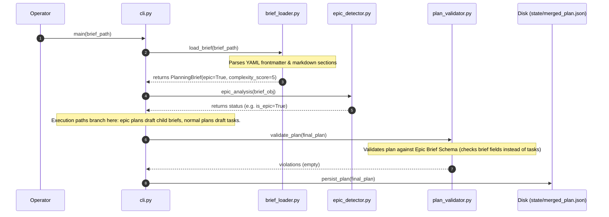

# Area A — Brief Ingestion & Planner Front-end / Schema

## 1. Summary
This area delivers the front-end schema and ingestion mechanics of the JanusMaskJR Hierarchical Planner. It extends the `PlanningBrief` representation to identify whether a brief is a high-level "epic" that decomposes into child briefs rather than leaf tasks, and records a target complexity score. It modifies the planner CLI (`cli.py`) to insert an epic-detection and complexity-analysis stage immediately following brief loading. It updates the plan validation framework (`plan_validator.py`) to dynamically apply different validation regimes depending on whether the plan represents an epic (containing a DAG of child briefs) or a normal leaf brief (containing a DAG of code-synthesis tasks). Finally, it expands the task taxonomies (`taxonomies.py`) to support hierarchical planning operations with appropriate bypass policies.

## 2. Existing Substrate
- **`harness/planner/brief_loader.py`**:
  - `@dataclass(frozen=True) PlanningBrief` ([brief_loader.py:L26-36](file:///home/xnihil0zer0/JanusMaskJR/harness/planner/brief_loader.py#L26-36)) stores parsed brief attributes.
  - `load_brief` ([brief_loader.py:L122-212](file:///home/xnihil0zer0/JanusMaskJR/harness/planner/brief_loader.py#L122-212)) parses frontmatter via YAML and section headers via regex.
- **`tools/webui_autobrief_prompt.txt`**:
  - Defines instructions for YAML frontmatter and required Markdown headings for brief generation ([webui_autobrief_prompt.txt:L9-18](file:///home/xnihil0zer0/JanusMaskJR/tools/webui_autobrief_prompt.txt#L9-18)).
- **`harness/planner/cli.py`**:
  - `PIPELINE_STAGES` ([cli.py:L9](file:///home/xnihil0zer0/JanusMaskJR/harness/planner/cli.py#L9)) defines the sequence of execution phases.
  - `main()` ([cli.py:L108-199](file:///home/xnihil0zer0/JanusMaskJR/harness/planner/cli.py#L108-199)) orchestrates the loading, execution, reconciliation, and writing of plans.
  - `persist_plan` ([cli.py:L86-107](file:///home/xnihil0zer0/JanusMaskJR/harness/planner/cli.py#L86-107)) serializes the plan structure to disk.
- **`harness/planner/plan_validator.py`**:
  - `check_missing_fields` ([plan_validator.py:L19-58](file:///home/xnihil0zer0/JanusMaskJR/harness/planner/plan_validator.py#L19-58)) and `validate_plan` ([plan_validator.py:L60-190](file:///home/xnihil0zer0/JanusMaskJR/harness/planner/plan_validator.py#L60-190)) validate the flat list of task structures.
- **`harness/planner/taxonomies.py`**:
  - `META_TASK_POLICY` ([taxonomies.py:L1](file:///home/xnihil0zer0/JanusMaskJR/harness/planner/taxonomies.py#L1)) lists allowed task types and their bypass properties.

## 3. Required Changes

| Change | File:Line Anchor | New or Modify | Viability Tag | Oracle-First? | Touches harness/? | Notes |
| :--- | :--- | :--- | :--- | :--- | :--- | :--- |
| Add `epic` and `complexity_score` fields to `PlanningBrief` | `harness/planner/brief_loader.py:27` | Modify | `[GREEN single-symbol]` | Yes | Yes | Extend dataclass fields with default values. |
| Ingest `epic` / `complexity_score` in `load_brief` | `harness/planner/brief_loader.py:158` | Modify | `[GREEN single-symbol]` | Yes | Yes | Add to `_optional` set, validate types, and populate fields. |
| Add `epic` and `complexity` specifications in template instructions | `tools/webui_autobrief_prompt.txt:11` | Modify | `[HAND]` | No | No | Update YAML block instructions. |
| Add new stage `epic_analysis` to `PIPELINE_STAGES` | `harness/planner/cli.py:9` | Modify | `[HAND]` | Yes | Yes | Insert `'epic_analysis'` stage after `'load_brief'`. |
| Define stage execution wrapper and invoke in main loop | `harness/planner/cli.py:44` & `151` | Modify | `[YELLOW multi-symbol]` | Yes | Yes | Inject and invoke the `epic_analysis` runner. |
| Update `persist_plan` to write epic schema fields | `harness/planner/cli.py:86` | Modify | `[GREEN single-symbol]` | Yes | Yes | Inject `epic` and `complexity_score` into the plan wrapper. |
| Support epic plans vs leaf plans in validation | `harness/planner/plan_validator.py:60` | Modify | `[YELLOW multi-symbol]` | Yes | Yes | Conditional validation path for epic plans (containing briefs). |
| Introduce parent/part validation metadata schema | `harness/planner/plan_validator.py:19` | Modify | `[GREEN single-symbol]` | Yes | Yes | Add validation for `parent_epic` and `epic_part` keys. |
| Add `epic_planning` and `sub_brief_planning` taxonomies | `harness/planner/taxonomies.py:1` | Modify | `[GREEN single-symbol]` | Yes | Yes | Extend `META_TASK_POLICY` dictionary. |

## 4. New Symbols / New Files

- **`harness/planner/cli.py`**:
  - `def epic_analysis(brief_obj: PlanningBrief, config: dict, state_dir: Path) -> dict:`
    - *Purpose*: Evaluates the brief structure to confirm epic status and computes or validates a complexity score.
- **`harness/planner/epic_detector.py`** (Alternative/helper module):
  - `def analyze_brief_hierarchy(brief: PlanningBrief) -> Tuple[bool, int]:`
    - *Purpose*: Evaluates natural language complexity cues (e.g., number of target modules, sub-deliverables) to suggest hierarchy viability.

## 5. Data-Flow / Sequence

## 6. Dependencies & Ordering
1. **Level 1 (Immediate)**:
   - Add schema properties to `PlanningBrief` (`brief_loader.py`).
   - Add new meta task types to `taxonomies.py`.
   - Update `plan_validator.py` to allow different task fields if it is a child brief or task.
   - Update `cli.py` to output the correct wrapper fields.
2. **Level 2 (Deferred)**:
   - Automated `epic_analysis` scoring stage (relying on model feedback rather than simple YAML declarations).

## 7. Risks, Red-Zones, and Open Questions
- **Class-Method Red-Zones**: The planner codebase is clean of OOP-heavy classes, relying on modular top-level functions, so no class-method edits (`[RED class-method]`) are required.
- **WebUI Compatibility**: Changing the frontmatter requirement could cause the webui assistant endpoint to fail validation if it is not updated simultaneously. The WebUI prompt and parser must be updated as a single transaction (`[HAND]`).

## 8. Anchor Appendix
- [PlanningBrief Definition](file:///home/xnihil0zer0/JanusMaskJR/harness/planner/brief_loader.py#L26-36)
- [load_brief Function](file:///home/xnihil0zer0/JanusMaskJR/harness/planner/brief_loader.py#L122-212)
- [PIPELINE_STAGES](file:///home/xnihil0zer0/JanusMaskJR/harness/planner/cli.py#L9)
- [persist_plan](file:///home/xnihil0zer0/JanusMaskJR/harness/planner/cli.py#L86-107)
- [check_missing_fields](file:///home/xnihil0zer0/JanusMaskJR/harness/planner/plan_validator.py#L19-58)
- [validate_plan](file:///home/xnihil0zer0/JanusMaskJR/harness/plan_validator.py#L60-190)
- [META_TASK_POLICY](file:///home/xnihil0zer0/JanusMaskJR/harness/planner/taxonomies.py#L1)
