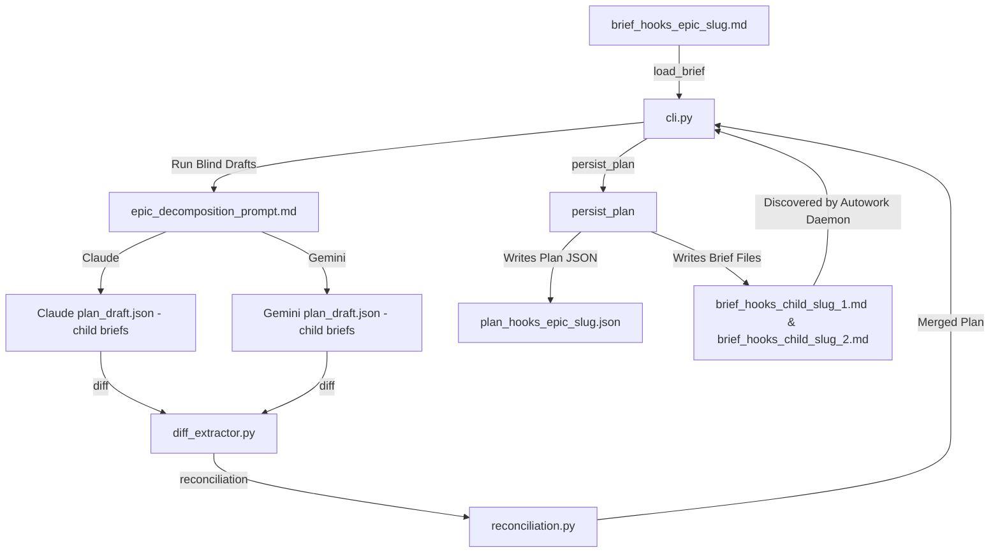

# Area B — The Decomposer Core (Dual-Model Differential Decomposition)

## 1. Summary
This area delivers the core dual-model differential decomposition engine. It is responsible for turning a single high-level "epic" brief into a set of child briefs. Crucially, it reuses the harness's existing differential synthesis pipelines (`blind_draft.py`, `diff_extractor.py`, `reconciliation.py`, etc.) to guarantee that decomposition decisions undergo the same dual-model blind-draft and reconciliation cycle as standard code changes, preventing single-model decomposition vulnerabilities. It generalizes the comparison and diffing algorithms to handle child briefs rather than leaf tasks, designs the prompts for epic decomposition, establishes static interface authoring contracts, and creates the file-system re-entry seam for child briefs to be processed by the existing planner.

## 2. Existing Substrate
- **`harness/planner/blind_draft.py`**:
  - `run_blind_drafts` ([blind_draft.py:L116-155](file:///home/xnihil0zer0/JanusMaskJR/harness/planner/blind_draft.py#L116-155)) invokes both models with a static prompt and collects their draft plans from their outboxes.
- **`harness/planner/diff_extractor.py`**:
  - `extract_diff` ([diff_extractor.py:L110-261](file:///home/xnihil0zer0/JanusMaskJR/harness/planner/diff_extractor.py#L110-261)) matches tasks from both drafts by ID or title/file heuristics and computes field-level differences.
- **`harness/planner/reconciliation.py`**:
  - `run_reconciliation` ([reconciliation.py:L57-239](file:///home/xnihil0zer0/JanusMaskJR/harness/planner/reconciliation.py#L57-239)) triggers a stance-taking round by both agents and reconciles divergent items using track-record tiebreakers.
- **`harness/selfheal.py`**:
  - `_synthesize_selfheal_plan` ([selfheal.py:L50-131](file:///home/xnihil0zer0/JanusMaskJR/harness/selfheal.py#L50-131)) and `_harvest_selfheal_briefs` ([selfheal.py:L225-414](file:///home/xnihil0zer0/JanusMaskJR/harness/selfheal.py#L225-414)) demonstrate the pattern of harvesting new markdown briefs from outboxes, writing plans, and initiating planning.

## 3. Required Changes

| Change | File:Line Anchor | New or Modify | Viability Tag | Oracle-First? | Touches harness/? | Notes |
| :--- | :--- | :--- | :--- | :--- | :--- | :--- |
| Dynamic prompt selection based on epic flag | `harness/planner/blind_draft.py:128` | Modify | `[GREEN single-symbol]` | Yes | Yes | If `brief.epic` is true, inject the epic decomposition prompt instead of the task planning prompt. |
| Generalize diff matching for child briefs | `harness/planner/diff_extractor.py:110` | Modify | `[YELLOW multi-symbol]` | Yes | Yes | Extend comparison logic to handle `child_briefs` key and compare brief-specific fields. |
| Compare brief fields (scope, deliverables, interfaces) | `harness/planner/diff_extractor.py:22` | Modify | `[GREEN single-symbol]` | Yes | Yes | Add `_compare_brief_fields` helper matching `_compare_fields` but tailored to briefs. |
| Support brief-level reconciliation prompts | `harness/planner/reconciliation.py:99` | Modify | `[GREEN single-symbol]` | Yes | Yes | Adjust the instructions prompt sent to agents when reconciling epic decompositions. |
| Write child brief files to disk upon epic plan persistence | `harness/planner/cli.py:94` | Modify | `[GREEN single-symbol]` | Yes | Yes | When writing an epic plan, write child briefs as `brief_hooks_<child_slug>.md` to the repository root. |

## 4. New Symbols / New Files

- **`harness/planner/prompts/epic_decomposition_prompt.md`**:
  - *Purpose*: System prompt instructing both models to draft child briefs (with YAML frontmatter, Title, Scope, Non-Goals, Inputs, Deliverables, and Interfaces) rather than leaf tasks.
- **`harness/planner/prompts/epic_reconciliation_prompt.md`**:
  - *Purpose*: Prompt guiding the models on how to defend, concede, or amend divergent child brief definitions.
- **`harness/planner/brief_generator.py`**:
  - `def serialize_brief_object_to_markdown(brief_data: dict) -> str:`
    - *Purpose*: Converts the JSON representation of a child brief (produced by reconciliation) back into standard Markdown text with YAML frontmatter.

## 5. Data-Flow / Sequence

### Static Interface Authoring Data Flow:
1. Sibling ordering is wired by defining `dependencies` in the child briefs' frontmatter (e.g., `child_2` has `relates_to` or `dependencies` pointing to `child_1`).
2. Sibling symbol contracts are frozen as static text in `spec.interfaces` during decomposition:
   - `child_1` brief specifies: `Deliverable: module x.py must expose func_y(a: int) -> str`.
   - `child_2` brief specifies: `Interfaces: func_y(a: int) -> str from module x.py`.
3. Since `child_2` depends on `child_1`, the autowork daemon ensures `child_1` leaf tasks are fully accepted before `child_2` tasks are staged. At runtime, the code synthesized for `child_2` binds to `x.py:func_y` which has already been written and tested.

## 6. Dependencies & Ordering
1. **Level 1 (Immediate)**:
   - Create `epic_decomposition_prompt.md` and `epic_reconciliation_prompt.md` templates.
   - Modify `diff_extractor.py` and `reconciliation.py` to support `child_briefs` comparison.
   - Implement `brief_generator.py` for serializing child brief json to disk.
2. **Level 2 (Deferred)**:
   - Dynamic interface generation or schema validation (ensuring matching interface strings in dependent briefs).

## 7. Risks, Red-Zones, and Open Questions
- **DAG Complexity**: If the models decompose an epic into a deeply nested dependency chain, the overall cycle time to execute the epic increases. Depth budgets must be strictly enforced.
- **Diff Ambiguity**: Since briefs contain more natural language than structured task fields, the heuristic matcher in `diff_extractor.py` may encounter higher rates of ambiguous matches. Prompt tuning will be required to force stable brief IDs and titles.

## 8. Anchor Appendix
- [run_blind_drafts](file:///home/xnihil0zer0/JanusMaskJR/harness/planner/blind_draft.py#L116-155)
- [extract_diff](file:///home/xnihil0zer0/JanusMaskJR/harness/planner/diff_extractor.py#L110-261)
- [run_reconciliation](file:///home/xnihil0zer0/JanusMaskJR/harness/planner/reconciliation.py#L57-239)
- [_harvest_selfheal_briefs](file:///home/xnihil0zer0/JanusMaskJR/harness/selfheal.py#L225-414)
