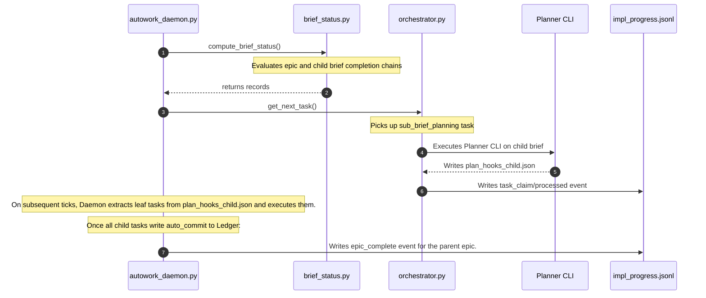

# Area C — Dispatch, Staging, Execution & Completion Roll-Up

## 1. Summary
This area delivers the staging, dispatching, execution, and completion tracking mechanisms of the Hierarchical Planner. It extends the autowork daemon (`autowork_daemon.py` and `brief_status.py`) to handle epic briefs and stage child briefs while honoring sibling dependencies. It integrates a dispatch hook into the orchestrator (`orchestrator.py`) to recognize child briefs as planning tasks rather than code-synthesis tasks, redirecting them to the planner CLI. It updates `depth_validator.py` to validate parent-brief lineage depths and implements a parent/child completion roll-up engine that updates `state/impl_progress.jsonl` with epic completion rows without breaking flat downstream consumers.

## 2. Existing Substrate
- **`harness/autowork_daemon.py`**:
  - `_auto_promote` ([autowork_daemon.py:L1204-1487](file:///home/xnihil0zer0/JanusMaskJR/harness/autowork_daemon.py#L1204-1487)) stages unstaged tasks from plan files.
  - Uses a staging dependencies gate ([autowork_daemon.py:L1350-1358](file:///home/xnihil0zer0/JanusMaskJR/harness/autowork_daemon.py#L1350-1358)) to block staging until prerequisite tasks are accepted.
- **`harness/brief_status.py`**:
  - `compute_brief_status` ([brief_status.py:L4-75](file:///home/xnihil0zer0/JanusMaskJR/harness/brief_status.py#L4-75)) evaluates if planning is required and computes the active state (unplanned, planned, queued, in_flight, complete, zombie, blocked).
- **`harness/orchestrator.py`**:
  - `get_next_task` ([orchestrator.py:L1249-1354](file:///home/xnihil0zer0/JanusMaskJR/harness/orchestrator.py#L1249-1354)) claims files from the task queue and enforces unmet dependency gates.
- **`harness/depth_validator.py`**:
  - `check_true_depth` ([depth_validator.py:L6-75](file:///home/xnihil0zer0/JanusMaskJR/harness/depth_validator.py#L6-75)) counts the depth of parent tasks to prevent infinite execution loops.
- **`harness/task_decomposer.py`**:
  - Writes subtask JSON definitions ([task_decomposer.py:L330-347](file:///home/xnihil0zer0/JanusMaskJR/harness/task_decomposer.py#L330-347)) and updates parent status in `STATE.json` ([task_decomposer.py:L349-359](file:///home/xnihil0zer0/JanusMaskJR/harness/task_decomposer.py#L349-359)).

## 3. Required Changes

| Change | File:Line Anchor | New or Modify | Viability Tag | Oracle-First? | Touches harness/? | Notes |
| :--- | :--- | :--- | :--- | :--- | :--- | :--- |
| Inject child-brief staging support in `_auto_promote` | `harness/autowork_daemon.py:1333` | Modify | `[YELLOW multi-symbol]` | Yes | Yes | Enable staging of briefs (creates brief files instead of task JSON). |
| Sibling dependency validation in queue claim | `harness/orchestrator.py:1307` | Modify | `[GREEN single-symbol]` | Yes | Yes | Ensure child briefs are gated by sibling dependencies. |
| Intercept child briefs in dispatch worker | `harness/orchestrator.py:1354` | Modify | `[YELLOW multi-symbol]` | Yes | Yes | If task matches `sub_brief_planning` meta type, invoke planner CLI rather than code synthesis. |
| Extend parent chain traversal to support epic hierarchies | `harness/depth_validator.py:61` | Modify | `[GREEN single-symbol]` | Yes | Yes | Check both `parent_task` and `parent_epic` parameters. |
| Roll up child completion states recursively | `harness/brief_status.py:46` | Modify | `[YELLOW multi-symbol]` | Yes | Yes | An epic's completeness depends on all of its child briefs being complete. |
| Append epic completion telemetry to ledger | `harness/autowork_daemon.py:1235` | Modify | `[GREEN single-symbol]` | Yes | Yes | Write `epic_complete` event rows to `impl_progress.jsonl`. |

## 4. New Symbols / New Files

- **`harness/orchestrator.py`**:
  - `def _execute_sub_brief_planning(task: dict, state_dir: Path) -> bool:`
    - *Purpose*: Invokes the planning pipeline (`python -m harness.planner.cli`) to expand a child brief into its final leaf tasks.
- **`harness/brief_status.py`**:
  - `def get_epic_lineage(slug: str, repo_root: Path) -> List[str]:`
    - *Purpose*: Recursively maps child briefs back to their originating parent epics.

## 5. Data-Flow / Sequence

## 6. Dependencies & Ordering
1. **Level 1 (Immediate)**:
   - Extend `check_true_depth` to inspect `parent_epic`.
   - Update `get_next_task` to prevent dispatching briefs to code synthesis.
   - Implement `_execute_sub_brief_planning` inside `orchestrator.py` to trigger child brief planning.
   - Update `compute_brief_status` to recursively determine epic completion.
2. **Level 2 (Deferred)**:
   - Auto-cleanup of intermediate child-brief plans upon parent epic completion.

## 7. Risks, Red-Zones, and Open Questions
- **Class-Method Red-Zones**:
  - Modifying `orchestrator.py`'s serial dispatch loops must be done via top-level function wrappers rather than class edits to avoid AST-merge failures (`[RED class-method]`).
- **Orphan / Zombie Prevention**:
  - If a child brief fails to plan, the parent epic must not hang. A failure propagation mechanism must automatically mark the parent epic as blocked.

## 8. Anchor Appendix
- [_auto_promote](file:///home/xnihil0zer0/JanusMaskJR/harness/autowork_daemon.py#L1204-1487)
- [get_next_task](file:///home/xnihil0zer0/JanusMaskJR/harness/orchestrator.py#L1249-1354)
- [check_true_depth](file:///home/xnihil0zer0/JanusMaskJR/harness/depth_validator.py#L6-75)
- [compute_brief_status](file:///home/xnihil0zer0/JanusMaskJR/harness/brief_status.py#L4-75)
- [update_parent_state](file:///home/xnihil0zer0/JanusMaskJR/harness/task_decomposer.py#L349-359)
