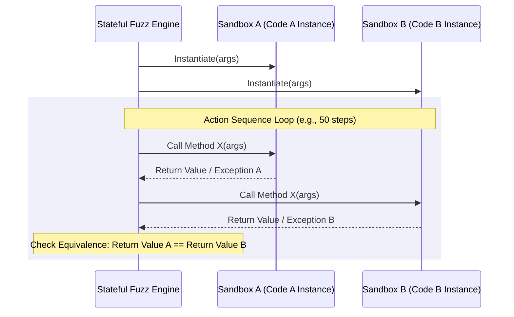

# Technical Report: Method D — Stateful/Rule-Based Property-Based Testing

This report explores **Method D: Stateful/Rule-Based Property-Based Testing** in the context of the **JanusMaskJR** validation harness. It reviews the current state of stateless differential fuzzing, analyzes existing hooks in the codebase, structures stateful property-based testing (PBT) models, and proposes a concrete implementation plan for full integration of rule-based state machine fuzzing into the orchestrator pipeline.

---

## 1. Core Mechanism of Stateful/Rule-Based PBT

Stateful Property-Based Testing (PBT) is a validation methodology designed for systems whose behavior depends on the history of previous operations (e.g., state machines, caches, databases, transactional APIs). 

### Stateless vs. Stateful Fuzzing
*   **Stateless Fuzzing (e.g., current `diff_fuzzer.py`):** Generates independent values (inputs) for a single function call, runs both code versions on these inputs, and compares outputs. This assumes the function is pure or has no persistent side-effects or historical state dependency.
*   **Stateful Fuzzing:** Models the System Under Test (SUT) as a state machine. It generates *sequences of actions* (API calls with type-aware generated parameters) that mutate the SUT's state. After each step, the fuzzer verifies that safety properties and state invariants hold.

### Differential Stateful Fuzzing
In a differential testing harness like JanusMaskJR, we lack an absolute specification oracle. Instead, we use **differential state equivalence**. We instantiate the stateful class from two separate submissions (e.g., Code A from Claude and Code B from Gemini) and execute the exact same sequence of actions on both instances:



### Trace Comparison and Equivalence Criteria
For each step in the action sequence, the engine asserts:
1.  **Exception Equivalence:** If step $i$ raises an exception on Instance A, it must raise a matching exception class on Instance B.
2.  **Return Value Equivalence:** If step $i$ returns a value, both must return values that match under structural comparison (e.g., `outputs_match`).
3.  **Observational State Equivalence:** Any subsequent query methods must return identical results. If internal state attributes are public, they can also be checked for structural equality.

### Counterexample Shrinking
If a sequence of 50 operations leads to a divergence at step 38, Hypothesis automatically shrinks the trace. It removes unnecessary steps (e.g., redundant puts/gets) to present a minimal failing sequence, such as:
```python
# Shrunk failing sequence
instance = Cache(capacity=2)
instance.put("key1", 10)
instance.put("key2", 20)
instance.put("key1", 30)  # Eviction or update logic diverges
instance.get("key1")      # Diverges here
```
This minimal trace is highly human-readable and provides a precise feedback loop for cross-examination.

---

## 2. Current Code, Designs, and Hooks in JanusMaskJR

JanusMaskJR contains several elements that lay the groundwork for Method D or demonstrate how stateful PBT is used internally:

### 2.1. `harness/diff_fuzzer.py`
The existing fuzzer handles stateless input synthesis. It provides:
*   **Type Annotation Parser:** Maps Python type annotation strings (e.g., `list[int]`, `dict[str, list[int]]`, `Optional[Path]`) into Hypothesis strategies using AST parsing (`_strategy_for_annotation` and `_ast_node_to_strategy`).
*   **Structural Equivalence Engine:** `outputs_match` and `_deep_compare` recursively verify structural equality of return values (including float tolerances, nested dictionaries, sequences, and sets) and exception classes.
*   **Sandboxing Infrastructure:** `Sandbox` and `BatchRunner` allow running code in separate processes with memory/time caps and Bubblewrap isolation.

### 2.2. Statefulness Detection in `harness/rebuild/harvest.py`
The harvest module defines:
*   `_class_is_stateful(node: ast.ClassDef) -> bool`: Detects classes that share state across methods by checking if `__init__` writes to `self.<attr>` and at least one other method reads `self.<attr>`.
*   Currently, stateful classes are routed to class-granular reconstruction because per-method unit testing fails on shared state. However, they bypass differential fuzzing.

### 2.3. Task Taxonomies in `harness/planner/taxonomies.py`
In the task policy configuration, tasks of type `state_machine` are marked with `'bypass_fuzzer': True`. This is because stateless fuzzing cannot verify a state machine. Integrating Method D will allow these tasks to run through stateful fuzzing rather than bypassing it completely.

### 2.4. Native Hypothesis Stateful Tests
The codebase contains high-quality stateful tests validating its own internals:
*   `tests/adversarial/test_P5_orchestrator_stateful.py`: Models `harness/orchestrator.py::run_pipeline` as a native Hypothesis `RuleBasedStateMachine` using `Bundle`, `@initialize`, `@rule`, and `@invariant` to test orchestrator lifecycles.
*   `tests/adversarial/test_P2_persist_gate_hypothesis.py::EnsureValidMachine`: Drives AST validation gates with arbitrary sequences of code validator runs to ensure determinism and compliance.

---

## 3. Concrete Integration Proposal

To support stateful differential testing without introducing excessive overhead or complex dynamic class definition inside the sandbox, we propose an **Action-Sequence Strategy** rather than native `RuleBasedStateMachine` definition.

Generating native `RuleBasedStateMachine` subclasses dynamically at runtime is complex, hard to serialize across a subprocess boundary, and makes shrinking fragile. Instead, we can generate a **symbolic command list** (a sequence of actions) in the orchestrator and execute it sequentially on the sandboxed instances.

```
                  +--------------------------+
                  |  Orchestrator (Host)     |
                  |  - Parse AST / Signatures|
                  |  - Generate Action Trace |
                  +-------------+------------+
                                |
             +------------------+------------------+
             | (Serialize Trace)                   | (Serialize Trace)
             v                                     v
  +----------------------+              +----------------------+
  | Sandbox A (Subproc)  |              | Sandbox B (Subproc)  |
  |  - Import Code A     |              |  - Import Code B     |
  |  - Run Action Trace  |              |  - Run Action Trace  |
  |  - Return Result list|              |  - Return Result list|
  +----------+-----------+              +----------+-----------+
             |                                     |
             +------------------+------------------+
                                | (Gather results)
                                v
                  +--------------------------+
                  |  Orchestrator (Host)     |
                  |  - Compare traces        |
                  |  - Shrink failing trace  |
                  +--------------------------+
```

### Step 3.1: AST Interface Parsing
Add class parsing to extract the target constructor and method signatures.

```python
# Proposed in harness/diff_fuzzer.py
import ast

def extract_class_interface(code: str, class_name: str) -> dict[str, Any]:
    """Parse code and return signatures for the constructor and public methods."""
    tree = ast.parse(code)
    for node in ast.walk(tree):
        if isinstance(node, ast.ClassDef) and node.name == class_name:
            methods = {}
            for item in node.body:
                if isinstance(item, (ast.FunctionDef, ast.AsyncFunctionDef)):
                    if item.name.startswith('_') and item.name != '__init__':
                        continue
                    # Extract parameter annotations
                    params = {}
                    for arg in item.args.args:
                        if arg.arg == 'self':
                            continue
                        params[arg.arg] = ast.unparse(arg.annotation) if arg.annotation else 'int'
                    methods[item.name] = params
            return methods
    raise ValueError(f"Class {class_name} not found")
```

### Step 3.2: Hypothesis Action Strategy
Generate sequences of symbolic actions: `(method_name, args, kwargs)`.

```python
# Proposed in harness/diff_fuzzer.py
from hypothesis import strategies as st

def build_stateful_strategy(interface: dict[str, Any]) -> st.SearchStrategy:
    """Build a strategy that yields (init_args, list_of_method_calls)."""
    
    # Init strategy
    init_params = interface.get('__init__', {})
    init_param_strategies = {name: _strategy_for_annotation(annot) for name, annot in init_params.items()}
    
    @st.composite
    def init_strategy(draw):
        args = [draw(init_param_strategies[p]) for p in init_params]
        return args

    # Method call strategies
    call_strategies = []
    for method_name, params in interface.items():
        if method_name == '__init__':
            continue
        param_strategies = {name: _strategy_for_annotation(annot) for name, annot in params.items()}
        
        @st.composite
        def make_call(draw, m_name=method_name, p_names=list(params.keys()), p_strats=param_strategies):
            args = [draw(p_strats[name]) for name in p_names]
            return (m_name, args)
        
        call_strategies.append(make_call())

    action_list_strategy = st.lists(st.one_of(call_strategies), min_size=5, max_size=50)
    return st.tuples(init_strategy(), action_list_strategy)
```

### Step 3.3: Sandboxed Stateful Execution
Modify `harness/sandbox.py` or write a custom driver wrapper in the sandbox workspace to consume action sequences.

```python
# Draft of the sandbox execution code executed in the jail
def execute_stateful_trace(class_module: str, class_name: str, init_args: list, trace: list) -> list[dict]:
    import importlib
    mod = importlib.import_module(class_module)
    cls = getattr(mod, class_name)
    
    # Instantiate
    try:
        instance = cls(*init_args)
    except Exception as exc:
        return [{"step": "init", "success": False, "exception_type": type(exc).__name__, "exception_message": str(exc)}]
        
    results = []
    for idx, (method_name, args) in enumerate(trace):
        try:
            method = getattr(instance, method_name)
            res = method(*args)
            # Serialize result via SandboxEncoder representation
            results.append({
                "step": idx,
                "method": method_name,
                "success": True,
                "return_value": res,
                "return_repr": repr(res)
            })
        except Exception as exc:
            results.append({
                "step": idx,
                "method": method_name,
                "success": False,
                "exception_type": type(exc).__name__,
                "exception_message": str(exc)
            })
    return results
```

### Step 3.4: Orchestrator Integration
Update `harness/orchestrator.py` to route stateful tasks through the new fuzzer instead of bypassing them.

1.  **Modify `harness/planner/taxonomies.py`**:
    Enable fuzzing for state machines and data models:
    ```python
    # Before:
    # 'state_machine': {'bypass_fuzzer': True, 'skip_structural_decomp': True}
    # After:
    'state_machine': {'bypass_fuzzer': False, 'skip_structural_decomp': True, 'stateful_fuzz': True}
    ```

2.  **Add `stateful_differential_fuzz` in `harness/orchestrator.py`**:
    ```python
    def stateful_differential_fuzz(code_a: str, code_b: str, class_name: str, config: dict, session_id: str) -> FuzzResult:
        # 1. Extract class interface
        interface = extract_class_interface(code_a, class_name)
        # 2. Build Hypothesis strategy
        strategy = build_stateful_strategy(interface)
        # 3. Generate action sequences
        inputs = _generate_inputs(strategy, count=200, seed=config.get('fuzzing', {}).get('seed', 42))
        
        # 4. Run through sandbox and compare step-by-step
        # (Compare execution trace results using outputs_match)
        # If any trace diverges, capture the failure and shrink the action sequence.
        ...
    ```

---

## 4. Confidence Level Added to the Verification Pipeline

Integrating Method D adds unique guarantees to the JanusMaskJR pipeline:

1.  **Elimination of the Stateful Bypass Gap:**
    Currently, any complex refactoring of caches, state machines, and API adapters bypasses differential verification entirely because the stateless fuzzer cannot execute them. Method D closes this loophole, ensuring *all* components are validated under identical workloads.

2.  **Verification of Multi-Method Interactions:**
    Stateless tests check one method in isolation. Stateful PBT validates sequences of method calls (e.g., `write -> read -> write -> read`). This catches bugs where Method B corrupts internal structures that only Method C reads, which is a major source of cache-eviction and state-drift failures.

3.  **Concurrency and Resource Leakage Canaries:**
    By executing long traces (e.g., 50 operations), stateful testing acts as a natural validator for resource exhaustion, memory leaks, and unhandled transition exceptions, raising the confidence level of the refactored code to a production-ready standard.

4.  **Integration with Cross-Examination Prompts:**
    A shrunken trace of operations provides high-fidelity, reproducible bug reports. Feeding a trace like `"Init cache(capacity=2) -> Put(k1, v1) -> Put(k2, v2) -> Put(k3, v3) -> Get(k1) returns None in A but v1 in B"` to Claude and Gemini allows them to understand eviction mismatch instantly and apply precise fixes.
